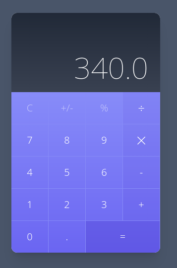
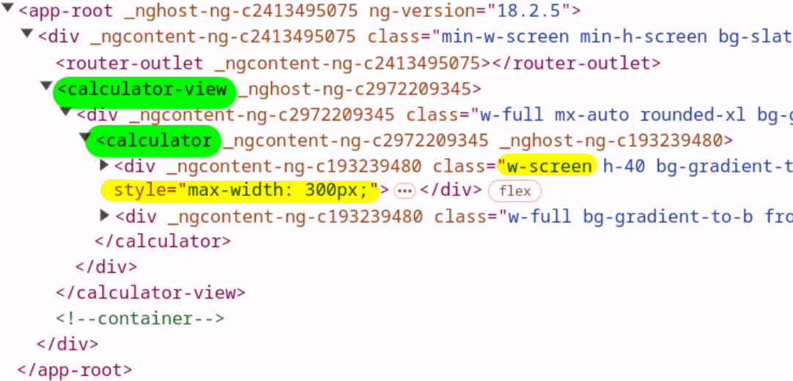
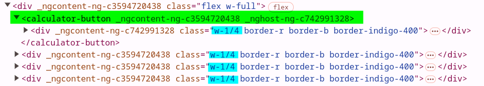
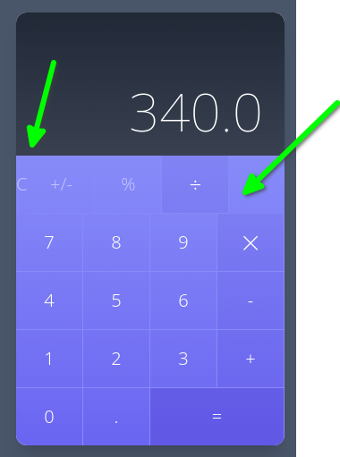
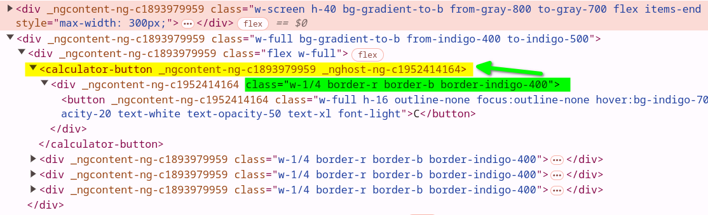
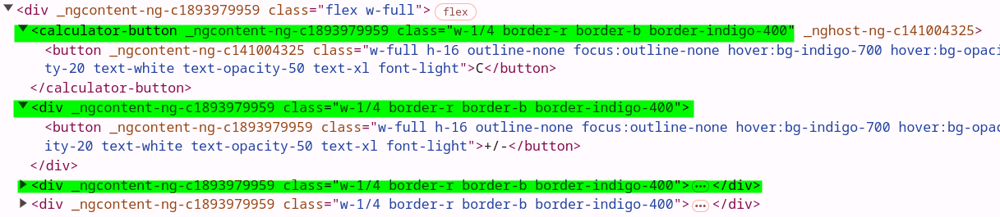
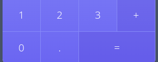

<head>
  <link rel="stylesheet" href="md.css">
</head>


# Curso Avanzado de Angular

<strong>
Plataforma: Udemy   |Instructor: Fernando Herrera |Fecha: Marzo 2023
</strong>


<br/><br/>
## Nota del Autor:

El siguiente documento constituye una exhaustiva recopilación de los conocimientos y prácticas derivados del curso de Angular ofrecido en la plataforma Udemy. Su propósito fundamental radica en servir como un recurso detallado y de fácil acceso para futuras referencias en mi trayectoria profesional.

Además de presentar el código proporcionado por el instructor, este documento incluye explicaciones detalladas de ciertos conceptos que, aunque se abordaron en el curso de Angular Avanzado, no fueron explorados en profundidad. Se ha procurado enriquecer la comprensión de estos temas mediante análisis más detallados. Esta extensión va más allá de la enseñanza estándar del curso, proporcionando una perspectiva más completa y facilitando la asimilación de conceptos clave. Así, este material no solo actúa como una recopilación de lo aprendido, sino también como un recurso complementario que busca ofrecer una comprensión más holística de los temas tratados en el curso.

Quisiera enfatizar que este material no tiene como finalidad generar lucro alguno. En lugar de ello, busca únicamente consolidar y mantener frescos los conocimientos adquiridos durante el curso. Es importante señalar que la mayor parte del código presente en este documento ha sido proporcionado por el instructor, **Fernando Herrera**. Solo en casos excepcionales se han incorporado modificaciones o funcionalidades adicionales como resultado de prácticas complementarias.

Esta recopilación se presenta como una herramienta personal, creada con el objetivo de fortalecer y consolidar los conceptos aprendidos en el curso de Angular Avanzado. Agradezco profundamente al instructor por compartir su experiencia y conocimientos, los cuales han sido fundamentales para mi desarrollo en esta tecnología.

Espero que este documento no solo sirva como recordatorio para mí, sino también como una fuente de conocimiento para otros estudiantes interesados en profundizar en Angular. Cabe destacar que cualquier beneficio derivado de este material debe ser atribuido principalmente al esfuerzo y dedicación del instructor y la plataforma Udemy, a quienes agradezco por facilitar este valioso aprendizaje.

[Mas información Aquí: https://www.udemy.com/course/angular-pro-siguiente-nivel/](https://www.udemy.com/course/angular-pro-siguiente-nivel/)


__20/Septiembre 2024 - ...__

<div style="page-break-after: always;"></div>

## C O N T E N I D O
<hr/>


<div style="page-break-after: always;"></div>

## Instalación

# Angular Pro

Descargar esta hoja de atajos:
[Guías de atajos - Angular ](https://devtalles.com/files/angular-cheat-sheet-v2.pdf)


1. [Node JS](https://nodejs.org/es/)

2. [VSCode - Visual Studio Code](https://code.visualstudio.com/)

4. [Postman](https://www.postman.com/downloads/)

5. [Git](https://git-scm.com/)
```
git config --global user.name "Tu nombre"
git config --global user.email "Tu correo"
```

5. [Docker Desktop](https://www.docker.com/get-started)
  

## AngularCLI
Documentación [oficial de Angular CLI](https://angular.io/cli)

Ejecutar el siguiente comando como __administrador__
```
npm install -g @angular/cli
```

## Extensiones de VSCode

* [Angular Language Service](https://marketplace.visualstudio.com/items?itemName=Angular.ng-template)

* [Angular Snippets](https://marketplace.visualstudio.com/items?itemName=johnpapa.Angular2)

* [Angular Schematics](https://marketplace.visualstudio.com/items?itemName=cyrilletuzi.angular-schematics)

* [Angular 2 Inline](https://marketplace.visualstudio.com/items?itemName=natewallace.angular2-inline)

* [Auto Close Tag](https://marketplace.visualstudio.com/items?itemName=formulahendry.auto-close-tag)

* [Auto Rename Tag](https://marketplace.visualstudio.com/items?itemName=formulahendry.auto-rename-tag)

* [Console Ninja](https://marketplace.visualstudio.com/items?itemName=WallabyJs.console-ninja)

* [Error Lens](https://marketplace.visualstudio.com/items?itemName=usernamehw.errorlens)

* [Paste JSON as Code](https://marketplace.visualstudio.com/items?itemName=quicktype.quicktype)

* [Editor Config for VSCode](https://marketplace.visualstudio.com/items?itemName=EditorConfig.EditorConfig)

* [Better Comments](https://marketplace.visualstudio.com/items?itemName=aaron-bond.better-comments)

* [Terminal](https://marketplace.visualstudio.com/items?itemName=formulahendry.terminal)

* [Tailwind CSS IntelliSense](https://marketplace.visualstudio.com/items?itemName=bradlc.vscode-tailwindcss)


### Tema que estoy usando en VSCode y Wallpaper del curso:

* [Aura Theme](https://marketplace.visualstudio.com/items?itemName=DaltonMenezes.aura-theme)

* [Tokyo Night](https://marketplace.visualstudio.com/items?itemName=enkia.tokyo-night)

* [Tokyo Night Dark](https://marketplace.visualstudio.com/items?itemName=drewxs.tokyo-night-dark)

* [Material Icons](https://marketplace.visualstudio.com/items?itemName=PKief.material-icon-theme)

* [Bearded Icons](https://marketplace.visualstudio.com/items?itemName=BeardedBear.beardedicons)

* [Wallpapers Developer](https://drive.google.com/drive/folders/1ItU8rbSGJjnh2USOBGwaCo9nYKifPJ6m?usp=sharing)


<div style="page-break-after: always;"></div>

# Nueva Sección: Zoneless Calculator:

## ¿Qué veremos en esta sección?


En esta sección vamos a trabajar con una estructura HTML hecha en *Tailwind*, que nos enseñe los problemas estructurales a los que vamos a caer cuando queramos recrear un diseño en componentes de Angular.


Puntualmente veremos:


- Tailwind
- Zoneless
- OnPush
- ViewEncapsulation
- ng-deep (Deprecared)
- Content Projection
- input Signals
- Standalone components
- Angular Schematics
- Host bindings
- Entre otros temas


## Nueva APP 

```shell
$ ng new zoneless-calculator
```


## Configurar Paths

Para hacer más fácil los imports, en el tsconfig.json

```json
"compilerOptions": {
    "baseUrl": ".",
    "paths": {
      "@/*": ["src/app/*"],
      "@app/*": ["src/app/*"],
    },
```

Instalamos y configuramos **tailwindCss**

```bash
$ npm install -D tailwindcss postcss autoprefixer
$ npx tailwindcss init
```

El init crea nuestro archivo de configuración **tailwind.config.js
**

Agregamos en el archivo **tailwind.config.js** los Paths a todos nuestros archiso de plantilla

```json
content: [
    "./src/**/*.{html,ts}",
  ],
```

Agregamos en el **style.css** las directivas de tailwind

```css
@tailwind base;
@tailwind components;
@tailwind utilities;
```

En el caso de obtener el error:


```
Unknown at rule @tailwindcss(unknownAtRules)
```

Consultar [Aca](https://stackoverflow.com/questions/76776910/unknown-at-rule-tailwind-cssunknownatrules-tailwind-error)


En VS Code:

File > Preference > Settings

Buscar **files.associations**

Agregar un nuevo item

Key:*.css

Value: tailwindcss


##  provideZoneChangeDetection vs provideExperimentalZonelessChangeDetection

Por default, Angular usa ZoneJS para la detección de cambios, para este ejercicio, usaremos un algoritmo de detección de cambios que no usa ZoneJS. 

En el archivo App.Config.js eliminamos la líena

```typescript
provideZoneChangeDetection({ eventCoalescing: true }),
```

y usamos en su lugar **provideExperimentalZonelessChangeDetection**


```typescript
import { ApplicationConfig, provideExperimentalZonelessChangeDetection } from '@angular/core';
import { provideRouter } from '@angular/router';

import { routes } from './app.routes';

export const appConfig: ApplicationConfig = {
  providers: [
    provideExperimentalZonelessChangeDetection(),
    provideRouter(routes)]
};
```

Luego del cambio veremos este mensaje en el console

```
core.mjs:32762 NG0914: The application is using zoneless change detection, but is still loading Zone.js. Consider removing Zone.js to get the full benefits of zoneless. In applications using the Angular CLI, Zone.js is typically included in the "polyfills" section of the angular.json file.
```

Para eliminar por completo el Zone.Js, en el angular.json, buscamos las referencias a zone.js y las removemos, por ejemplo

```json
"polyfills": [
  "zone.js",
  "zone.js/testing"
],
```

Lo cambiamos por:

```json
"polyfills": []
```

## Crear estructura base:

Creamos directorios:

```bash
└── calculator
    ├── components
    ├── services
    └── views
```

View, es lo que normalmente conocemos como pages, componentes de páginas completas que son usados en los routers y que agrupan otros componentes.

Creamos el primer Componente

```bash
$ ng g c calculator/views/calculatorView
```


## Rutas

En el app.routes.ts agregamos

```typescript
import { Routes } from '@angular/router';

export const routes: Routes = [
    {
        path: 'calculator',
        loadComponent: () => import('@app/calculator/views/calculator-view/calculator-view.component'),
    },
    {
        path: '**',
        redirectTo: 'calculator',
    }
];
```

Dos cosas a notar: Primero estamos usando el **@app/** del path configurado en el tsconfig.ts file, y lo segundo es que para que este import funcione, necesitamos agregar el key **default** en la definición de la clase del componente:

```typescript
export default class CalculatorViewComponent {

}
```

Dado que el componente no está definido dentro de un módulo, podemos importarlo directamente de esa forma.


## Diseño

El códido del template descargado del sitio del curso, genera la siguiente calculadora




Contiene mucho código repetido que vamos a transformar en componentes. El template completo es el siguiente:

```html
<div class="min-w-screen min-h-screen bg-gray-100 flex items-center justify-center px-5 py-5">
    <div class="w-full mx-auto rounded-xl bg-gray-100 shadow-xl text-gray-800 relative overflow-hidden" style="max-width:300px">
        <div class="w-full h-40 bg-gradient-to-b from-gray-800 to-gray-700 flex items-end text-right">
            <div class="w-full py-5 px-6 text-6xl text-white font-thin">340.0</div>
        </div>
        <div class="w-full bg-gradient-to-b from-indigo-400 to-indigo-500">
            <div class="flex w-full">
                <div class="w-1/4 border-r border-b border-indigo-400">
                    <button class="w-full h-16 outline-none focus:outline-none hover:bg-indigo-700 hover:bg-opacity-20 text-white text-opacity-50 text-xl font-light">C</button>
                </div>
                <div class="w-1/4 border-r border-b border-indigo-400">
                    <button class="w-full h-16 outline-none focus:outline-none hover:bg-indigo-700 hover:bg-opacity-20 text-white text-opacity-50 text-xl font-light">+/-</button>
                </div>
                <div class="w-1/4 border-r border-b border-indigo-400">
                    <button class="w-full h-16 outline-none focus:outline-none hover:bg-indigo-700 hover:bg-opacity-20 text-white text-opacity-50 text-xl font-light">%</button>
                </div>
                <div class="w-1/4 border-r border-b border-indigo-400">
                    <button class="w-full h-16 outline-none focus:outline-none bg-indigo-700 bg-opacity-10 hover:bg-opacity-20 text-white text-2xl font-light">÷</button>
                </div>
            </div>
            <div class="flex w-full">
                <div class="w-1/4 border-r border-b border-indigo-400">
                    <button class="w-full h-16 outline-none focus:outline-none hover:bg-indigo-700 hover:bg-opacity-20 text-white text-xl font-light">7</button>
                </div>
                <div class="w-1/4 border-r border-b border-indigo-400">
                    <button class="w-full h-16 outline-none focus:outline-none hover:bg-indigo-700 hover:bg-opacity-20 text-white text-xl font-light">8</button>
                </div>
                <div class="w-1/4 border-r border-b border-indigo-400">
                    <button class="w-full h-16 outline-none focus:outline-none hover:bg-indigo-700 hover:bg-opacity-20 text-white text-xl font-light">9</button>
                </div>
                <div class="w-1/4 border-r border-b border-indigo-400">
                    <button class="w-full h-16 outline-none focus:outline-none bg-indigo-700 bg-opacity-10 hover:bg-opacity-20 text-white text-xl font-light">⨉</button>
                </div>
            </div>
            <div class="flex w-full">
                <div class="w-1/4 border-r border-b border-indigo-400">
                    <button class="w-full h-16 outline-none focus:outline-none hover:bg-indigo-700 hover:bg-opacity-20 text-white text-xl font-light">4</button>
                </div>
                <div class="w-1/4 border-r border-b border-indigo-400">
                    <button class="w-full h-16 outline-none focus:outline-none hover:bg-indigo-700 hover:bg-opacity-20 text-white text-xl font-light">5</button>
                </div>
                <div class="w-1/4 border-r border-b border-indigo-400">
                    <button class="w-full h-16 outline-none focus:outline-none hover:bg-indigo-700 hover:bg-opacity-20 text-white text-xl font-light">6</button>
                </div>
                <div class="w-1/4 border-r border-b border-indigo-400">
                    <button class="w-full h-16 outline-none focus:outline-none bg-indigo-700 bg-opacity-10 hover:bg-opacity-20 text-white text-xl font-light">-</button>
                </div>
            </div>
            <div class="flex w-full">
                <div class="w-1/4 border-r border-b border-indigo-400">
                    <button class="w-full h-16 outline-none focus:outline-none hover:bg-indigo-700 hover:bg-opacity-20 text-white text-xl font-light">1</button>
                </div>
                <div class="w-1/4 border-r border-b border-indigo-400">
                    <button class="w-full h-16 outline-none focus:outline-none hover:bg-indigo-700 hover:bg-opacity-20 text-white text-xl font-light">2</button>
                </div>
                <div class="w-1/4 border-r border-b border-indigo-400">
                    <button class="w-full h-16 outline-none focus:outline-none hover:bg-indigo-700 hover:bg-opacity-20 text-white text-xl font-light">3</button>
                </div>
                <div class="w-1/4 border-r border-b border-indigo-400">
                    <button class="w-full h-16 outline-none focus:outline-none bg-indigo-700 bg-opacity-10 hover:bg-opacity-20 text-white text-xl font-light">+</button>
                </div>
            </div>
            <div class="flex w-full">
                <div class="w-1/4 border-r border-indigo-400">
                    <button class="w-full h-16 outline-none focus:outline-none hover:bg-indigo-700 hover:bg-opacity-20 text-white text-xl font-light">0</button>
                </div>
                <div class="w-1/4 border-r border-indigo-400">
                    <button class="w-full h-16 outline-none focus:outline-none hover:bg-indigo-700 hover:bg-opacity-20 text-white text-xl font-light">.</button>
                </div>
                <div class="w-2/4 border-r border-indigo-400">
                    <button class="w-full h-16 outline-none focus:outline-none bg-indigo-700 bg-opacity-30 hover:bg-opacity-40 text-white text-xl font-light">=</button>
                </div>
            </div>
        </div>
    </div>
</div>
```

Un componente Button que reciba el texto a desplegar y algunas clases podría evitar esta repetición de código.


## Componentes

Creamos:

```bash
$ ng g c calculator/components/calculator
```

Crearemos la siguiente estrucura de componentes

```bash
└──App-Component
  └── Calculator-View
    └── Calculator
      ├── Buttons
      └── Other Components
```

Primeramente el App Component unicamente contiene el wrapper de toda la app.

```html
<div class="min-w-screen min-h-screen bg-slate-600 flex items-center justify-center px-5 py-5">
    <router-outlet></router-outlet>
</div>
```

Por medio de las rutas, el **router-outlet** mostrará el componente indicado, en este caso, el **path: 'calculator',** mostrará el **Calculator-View

El template del Calculator-View es:

```html
<div class="w-full mx-auto rounded-xl bg-gray-100 shadow-xl text-gray-800 relative overflow-hidden">
    <calculator></calculator>
</div>
```

En este caso tomamos el siguiente contenedor y dentro de este mostraremos el componente calculator


Calculator por el momento contiene todo lo demás del template original


<aside class="nota-importante">
<p>Dado que estamos usando standalone component en este proyecto, no es necesario crear los módulos, simplemente creamos los componentes y los importamos donde sean necesarios</p>
</aside>


El Calculator Component

```typescript
import { ChangeDetectionStrategy, Component } from '@angular/core';

@Component({
  selector: 'calculator',
  standalone: true,
  imports: [],
  templateUrl: './calculator.component.html',
  styleUrl: './calculator.component.css',
  changeDetection: ChangeDetectionStrategy.OnPush,
})
export class CalculatorComponent {

}
```

El Calculator-View Component, lo importa y lo usa en su template

```typescript
import { CalculatorComponent } from '@/calculator/components/calculator/calculator.component';
import { ChangeDetectionStrategy, Component } from '@angular/core';

@Component({
  selector: 'calculator-view',
  standalone: true,
  imports: [ CalculatorComponent],
  templateUrl: './calculator-view.component.html',
  styleUrl: './calculator-view.component.css',
  changeDetection: ChangeDetectionStrategy.OnPush,
})
export default class CalculatorViewComponent {

}
```

## Cambios en la estructura del HTML

Al agregar componentes, el HTML original se renderiza con DIVS adicionales, tal como se nota en la siguiente imagen, esto puede generar que el diseño original cambie debido a que se rompe la secuencia de elementos hijos.



Esto implica que a veces se tenga que modificar el HTML original para mostrarse tal como se hacía al inicio, antes de introducir componentes.

En amarillo se muestran los cambios aplicados para mantener el diseño original.

Al introducir los siguiente componentes, como los botones, vamos a tener el mismo escenario.

El problema con esta solución es que a veces no podremos cambiar el estilo facilmente, y si deseamos mantener el mismo diseño original, debemos buscar otra solución, aca es donde aparecen los host-components.

## Host Element

La calculadora cuenta con una serie de botones:

```html
<div class="w-1/4 border-r border-b border-indigo-400">
    <button
        class="w-full h-16 outline-none focus:outline-none hover:bg-indigo-700 hover:bg-opacity-20 text-white text-opacity-50 text-xl font-light">
            C
    </button>
</div>
```

Transformar esto a un componente normal, introducirá DIV's adicionales que van a romper el estilo original.

Creamos el componente:

```bash
$ ng g c calculator/components/calculator-button
```

Copiamos (cortamo) el HTML del boton (incluyendo el DIV) y lo agregamos al template del nuevo componente

```html
<div class="w-1/4 border-r border-b border-indigo-400">
    <button class="w-full h-16 outline-none focus:outline-none hover:bg-indigo-700 hover:bg-opacity-20 text-white text-opacity-50 text-xl font-light">C</button>
</div>
```

Importamos el componente en el **CalculatorComponent**

```typescript
import { ChangeDetectionStrategy, Component } from '@angular/core';
import { CalculatorButtonComponent } from '../calculator-button/calculator-button.component';

@Component({
  selector: 'calculator',
  standalone: true,
  imports: [CalculatorButtonComponent],
  templateUrl: './calculator.component.html',
  styleUrl: './calculator.component.css',
  changeDetection: ChangeDetectionStrategy.OnPush,
})
export class CalculatorComponent {

}
```

Y lo agregamos en lugar del HTML cortado.

```html
<calculator-button></calculator-button>
```

Esto genera un DIV adicioanl que rompe el estilo



El resultado es que el boton **"C"** no ocupa el 25% del ancho (Clase **w-1/4**)



## ngContent

La proyección de contenido es un patrón en el que se inserta o proyecta el contenido que se desea utilizar dentro de otro componente.

En nuestro ComponentButton podemos usar **ng-content**

```html
<button class="...">
    <ng-content></ng-content>
</button>
```

Y llamarlo de esta forma:

```html
<calculator-button>C</calculator-button>
```

Aun tenemos el problema original, pero ya podemos enviar el label del botón usando el ng-content, en este momento el HTML se ve de esta forma



Lo que necesitamos para tener el diseño original es que las clases marcadas en verde, puedan aplicarse al DIV generado por Angular en amarillo.

Para lograr esto, cambiaremos el template del boton

```html
<div class="w-1/4 border-r border-b border-indigo-400">
    <button class="w-full h-16 outline-none focus:outline-none hover:bg-indigo-700 hover:bg-opacity-20 text-white text-opacity-50 text-xl font-light">
        <ng-content></ng-content>
    </button>
</div>
```

Eliminamos el DIV y dejamos únicamente el button, y las clases del DIV las vamos a agregar al componente directamente

```typescript
import { ChangeDetectionStrategy, Component } from '@angular/core';

@Component({
  selector: 'calculator-button',
  standalone: true,
  imports: [],
  templateUrl: './calculator-button.component.html',
  styleUrl: './calculator-button.component.css',
  changeDetection: ChangeDetectionStrategy.OnPush,
  host: {
    class: 'w-1/4 border-r border-b border-indigo-400',
  },
})
export class CalculatorButtonComponent {

}
```

Notar como hemos agregado el host

```typescript
host: {
    class: 'w-1/4 border-r border-b border-indigo-400',
  },
```

De esta forma, el diseño origina se reestablece y el HTML queda de la siguiente manera




Ahora podemos usar nuestro nuevo componente

```html
<div class="flex w-full">
    <calculator-button>C</calculator-button>
    <calculator-button>+/-</calculator-button>
    <calculator-button>%</calculator-button>
    <calculator-button>÷</calculator-button>
</div>
```

Y de esta forma, hemos simplificado el HTML.

El único problema que tenemos es que el último botón, tiene un color de fondo diferente, y ahora mismo estamos aplicando las mismas clases a los botones por medio del host.

## InputSignal y HostBidings

Antes de usar los Inputs y HostBiding moveremos el CSS del Boton a su CSS correspondiente

```html
<button class="w-full h-16 outline-none focus:outline-none hover:bg-indigo-700 hover:bg-opacity-20 text-white text-opacity-50 text-xl font-light">
    <ng-content></ng-content>
</button>
```

Todas las class dle button la agregamos al archivo **calculator-button.component.css**

```css
button {
    @apply w-full h-16 outline-none focus:outline-none hover:bg-indigo-700 hover:bg-opacity-20 text-white text-opacity-50 text-xl font-light
}
```

Luega aplicamos estos cambios en el componente

```typescript
export class CalculatorButtonComponent {

  public isCommand = input(
    false, // default value
    {
      transform: (value: string) => typeof value === 'string' ? value === '' : value,
    }
  )

  @HostBinding('class.bg-indigo-700') get CommandStyle() {
    return this.isCommand();
  }

}
```

Además de estos cambios en el typescript, ahora podemos usar el atributo en el componente

```html
<calculator-button isCommand>÷</calculator-button>
```

Ahora el componente tiene un atributo llamado **isCommand**. Este atributo se usa para indicar que este botón es un "__comando__" en la calculadora (como los operadores **÷, ×, +**, etc.), en lugar de un número.


```typescript
public isCommand = input(
    false, // default value
    {
      transform: (value: string) => typeof value === 'string' ? value === '' : value,
    }
  )
```

**isCommand** es una propiedad del componente que puede ser configurada desde el HTML cuando el componente es utilizado. Se está utilizando una función __input()__ para definir el valor de esta propiedad.

**false**: Este es el valor predeterminado de **isCommand**, lo que significa que, si no se proporciona este atributo en el HTML, el botón no será tratado como un comando.

**transform**: Esta es una transformación que se aplica al valor de **isCommand** cuando se pasa desde el HTML. Si **isCommand** es una cadena vacía (''), se considerará como true (ya que en Angular, cuando un atributo se presenta sin valor, se lo trata como verdadero). Si no es una cadena vacía, entonces **isCommand** tomará el valor correspondiente.

De modo que esto `<calculator-button isCommand>÷</calculator-button>` definirá isCommand en true y esto `<calculator-button isCommand='false'>÷</calculator-button>` y también esto `<calculator-button>÷</calculator-button>` definirá isCommand en false.

**Host Binding (Decorador @HostBinding):**

El decorador **@HostBinding** vincula una clase CSS al componente cuando la propiedad **isCommand** es verdadera. En este caso, cuando el valor de **isCommand** es verdadero (true), se aplica la clase CSS **bg-indigo-700**.

El método **CommandStyle** usa **isCommand()** para determinar si debe aplicar la clase **bg-indigo-700.**


## Multiples class en el HostBiding

Si necesitaramos agregar más clases al HostBiding, lo ideal es definir una clase en el CSS, por ejemplo:

```css
.is-command {
    @apply bg-indigo-700 bg-opacity-20 text-opacity-100
}
```

## View Encapsulation

El cambio anterior aplica la clase **is-command** al componente hosting, este es el HTML renderizado

```html
<calculator-button _ngcontent-ng-c90236445="" iscommand="" class="w-1/4 border-r border-b border-indigo-400 is-command" _nghost-ng-c4087423074="" ng-reflect-is-command="">
    <button _ngcontent-ng-c4087423074="" class="w-full h-16 outline-none focus:outline-none hover:bg-indigo-700 hover:bg-opacity-20 text-white text-opacity-50 text-xl font-light">
        ÷
    </button>
</calculator-button>
```

Recordemos que el **<calculator-button isCommand>÷</calculator-button>** está definido en el compoente externo **Calculator-Component** mientras que el is-command lo estamos definiendo en a nivel del componente interno **Calculator-Button** por lo tanto, si bien agregamos la clase **is-command**, el estilo no se aplica, porque no está en su scope.

Una forma de solucionar es definir la clase **is-command** en el style.css global de la APP.

otra forma de solucionarlo es mantener la clase **is-command** en nuestro archivo **calculator-button.component.css** pero definirla con el atributo **::ng-deep**

```css
::ng-deep .is-command {
    @apply bg-indigo-700 bg-opacity-20 text-opacity-100
}
```

Esto no se recomienda porque Angular ha deprecado ese atributo.

La otra opción es indicarle a Angular que ese componente no encpasule nada, esto lo logramos si agregamos `encapsulation: ViewEncapsulation.None,` a la definición del componente:

```typescript
Component({
  selector: 'calculator-button',
  standalone: true,
  imports: [],
  templateUrl: './calculator-button.component.html',
  styleUrl: './calculator-button.component.css',
  changeDetection: ChangeDetectionStrategy.OnPush,
  host: {
    class: 'w-1/4 border-r border-b border-indigo-400',
  },
  encapsulation: ViewEncapsulation.None,
})
```

Esto sigue siendo una solución no ideal, porque podemos filtrar ciertos estilos a otros componentes, ya que estos estilos estarían disponibles a nivel global.


La solución ideal es colocar el is-command en el CSS del componente padre, en el archivo `calculator.component.css`


Aún con esta solución, estamos aplicando un estilo a un nivel superior, la solucion final ideal debe ser aplicar el estilo directamente en el ambito del ComponentButton, es decir directamente al botón.

Primero regresamos el CSS siguiente al **calculator-button.component.css**

```css
.is-command {
    @apply bg-indigo-700 bg-opacity-20 text-opacity-100
}
```

Segundo, eliminamos el **HostBiding** del componente **CalculatorButtonComponent**

```typescript
@HostBinding('class.is-command') get CommandStyle() {
    return this.isCommand();
  }
```

Finalmente en el template 

```html
<button [class.is-command]="isCommand()">
    <ng-content/>
</button>
```

Agregará la clase **is-command** cuando `isCommand()`,nuestro public input, sea true. Esto genera el HTML siguiente para el botón **÷**

```html
<calculator-button _ngcontent-ng-c90236445="" iscommand="" class="w-1/4 border-r border-b border-indigo-400" ng-reflect-is-command="">
    <button class="is-command">÷</button>
</calculator-button>
```

De esta forma el CSS queda aplicado a nivel del botón directamente y a la vez, dicha regla se define a nivel del mismo componente, respetando el encapsulamiento y evitando conflictos con otras reglas en nuestra app.

## Double Size
El botón "=" a parte de ser un comando tiene un ancho doble



Para aplicar la clase "w-2/4" usaremos el **@HostBinding** y agregaremos un nuevo input: **isDoubleSize**


```typescript
export class CalculatorButtonComponent {

  public isCommand = input(
    false, // default value
    {
      transform: (value: string) => typeof value === 'string' ? value === '' : value,
    }
  )

  public isDoubleSize = input(
    false, // default value
    {
      transform: (value: string) => typeof value === 'string' ? value === '' : value,
    }
  );

  @HostBinding('class') get DobleSizeStyle() {
    return this.isDoubleSize() ? 'w-2/4' : 'w-1/4';
  }
}
```

Finalmente en el template usamos el nuevo atributo:

```html
<calculator-button isCommand isDoubleSize>=</calculator-button>
```

De esta forma logramos aplicar la clase **w-2/4** al botón.

```html
<calculator-button
    _ngcontent-ng-c878039076="" iscommand="" isdoublesize=""
    class="border-r border-b border-indigo-400 w-2/4" ng-reflect-is-command="" ng-reflect-is-double-size="">
        <button class="is-command">
            =
        </button>
</calculator-button>
```

<aside class="nota-importante">
<p>Para evitar un conflicto de classes css, se aplicó un cambio, la clase w-* ahora es definida por el @HostBinding en lugar del host: {} directamente en el componente</p>
</aside>

**Nota agregada al curso:**

La solución propuesta en el curso genera un "conflicto" de clases css, el elemento host puede llegar a contener ambas clases w-1/2 y w-2/4 siendo lo correcto que solo se incluya una de ellas.


Yo haría esto: perimero remover el w-1/2 del Host

```json
    host: {
        class: 'border-r border-b border-indigo-400',
      },
```

y luego en el @HostBinding definir una de ellas

``` typescript
    @HostBinding('class') get DobleSizeStyle() {
        return this.isDoubleSize() ? 'w-2/4' : 'w-1/4';
      }
```

Con esto evitamos el conflicto entre las clases w-1/2 y w-2/4

