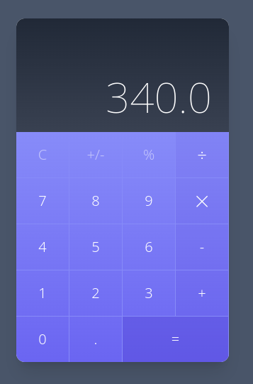
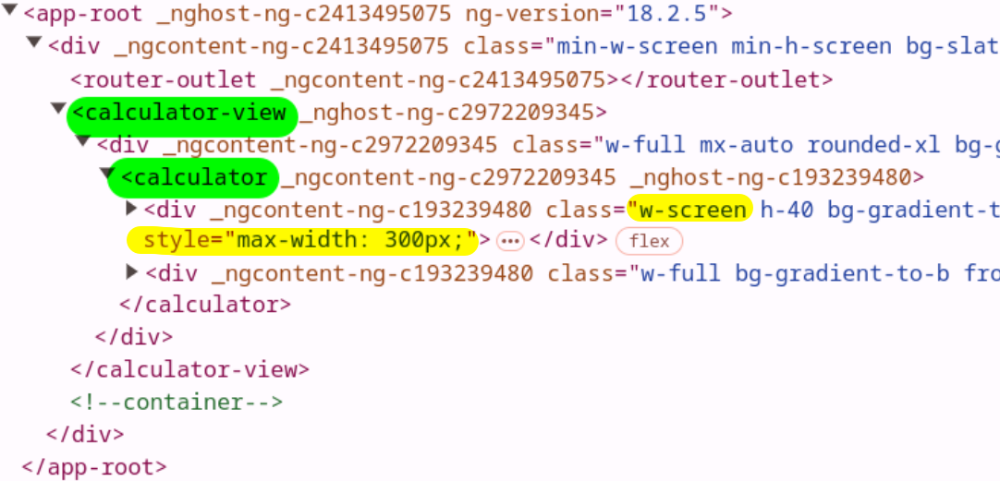
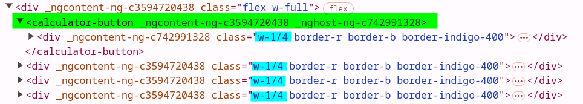
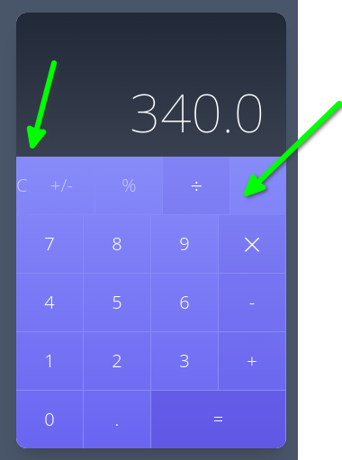
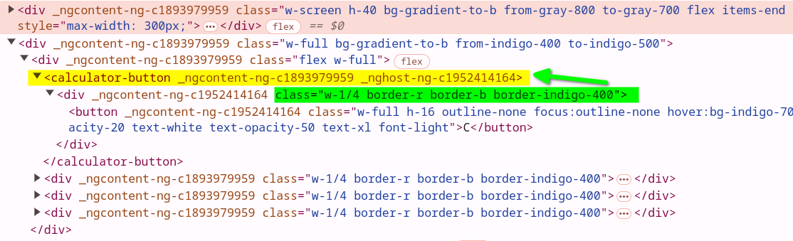
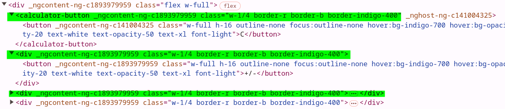
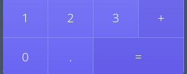
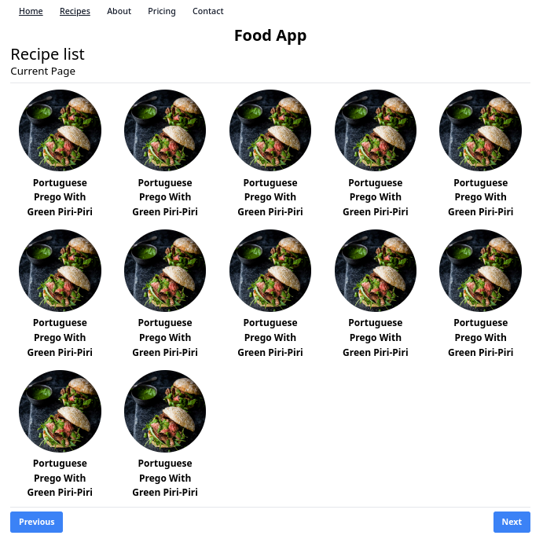
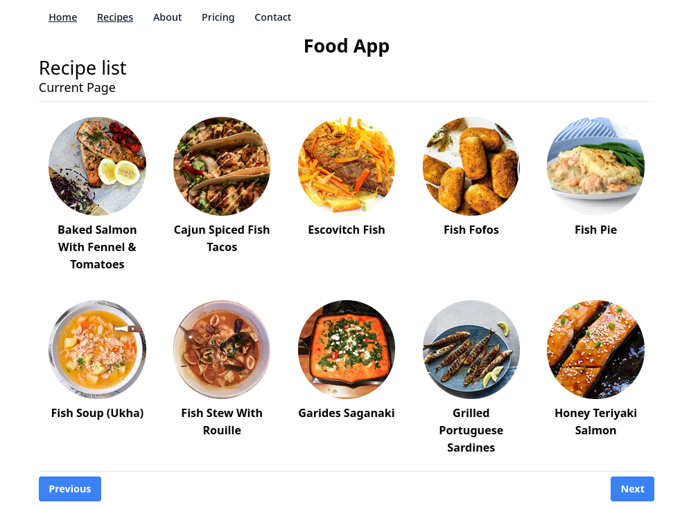
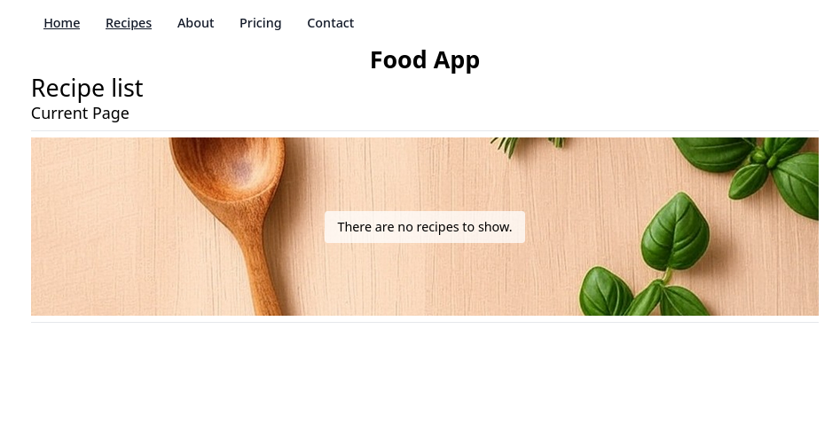

<head>
  <link rel="stylesheet" href="md.css">
</head>


# Curso Avanzado de Angular

<strong>
Plataforma: Udemy   |Instructor: Fernando Herrera |Fecha: Marzo 2023
</strong>


<br/><br/>
## Nota del Autor:

El siguiente documento constituye una exhaustiva recopilación de los conocimientos y prácticas derivados del curso de Angular ofrecido en la plataforma Udemy. Su propósito fundamental radica en servir como un recurso detallado y de fácil acceso para futuras referencias en mi trayectoria profesional.

Además de presentar el código proporcionado por el instructor, este documento incluye explicaciones detalladas de ciertos conceptos que, aunque se abordaron en el curso de Angular Avanzado, no fueron explorados en profundidad. Se ha procurado enriquecer la comprensión de estos temas mediante análisis más detallados. Esta extensión va más allá de la enseñanza estándar del curso, proporcionando una perspectiva más completa y facilitando la asimilación de conceptos clave. Así, este material no solo actúa como una recopilación de lo aprendido, sino también como un recurso complementario que busca ofrecer una comprensión más holística de los temas tratados en el curso.

Quisiera enfatizar que este material no tiene como finalidad generar lucro alguno. En lugar de ello, busca únicamente consolidar y mantener frescos los conocimientos adquiridos durante el curso. Es importante señalar que la mayor parte del código presente en este documento ha sido proporcionado por el instructor, **Fernando Herrera**. Solo en casos excepcionales se han incorporado modificaciones o funcionalidades adicionales como resultado de prácticas complementarias.

Esta recopilación se presenta como una herramienta personal, creada con el objetivo de fortalecer y consolidar los conceptos aprendidos en el curso de Angular Avanzado. Agradezco profundamente al instructor por compartir su experiencia y conocimientos, los cuales han sido fundamentales para mi desarrollo en esta tecnología.

Espero que este documento no solo sirva como recordatorio para mí, sino también como una fuente de conocimiento para otros estudiantes interesados en profundizar en Angular. Cabe destacar que cualquier beneficio derivado de este material debe ser atribuido principalmente al esfuerzo y dedicación del instructor y la plataforma Udemy, a quienes agradezco por facilitar este valioso aprendizaje.

[Mas información Aquí: https://www.udemy.com/course/angular-pro-siguiente-nivel/](https://www.udemy.com/course/angular-pro-siguiente-nivel/)


__20/Septiembre 2024 - ...__

<div style="page-break-after: always;"></div>

## C O N T E N I D O
<hr/>


<div style="page-break-after: always;"></div>

## Instalación

# Angular Pro

Descargar esta hoja de atajos:
[Guías de atajos - Angular ](https://devtalles.com/files/angular-cheat-sheet-v2.pdf)


1. [Node JS](https://nodejs.org/es/)

2. [VSCode - Visual Studio Code](https://code.visualstudio.com/)

4. [Postman](https://www.postman.com/downloads/)

5. [Git](https://git-scm.com/)
```
git config --global user.name "Tu nombre"
git config --global user.email "Tu correo"
```

5. [Docker Desktop](https://www.docker.com/get-started)


## AngularCLI
Documentación [oficial de Angular CLI](https://angular.io/cli)

Ejecutar el siguiente comando como __administrador__
```
npm install -g @angular/cli
```

## Extensiones de VSCode

* [Angular Language Service](https://marketplace.visualstudio.com/items?itemName=Angular.ng-template)

* [Angular Snippets](https://marketplace.visualstudio.com/items?itemName=johnpapa.Angular2)

* [Angular Schematics](https://marketplace.visualstudio.com/items?itemName=cyrilletuzi.angular-schematics)

* [Angular 2 Inline](https://marketplace.visualstudio.com/items?itemName=natewallace.angular2-inline)

* [Auto Close Tag](https://marketplace.visualstudio.com/items?itemName=formulahendry.auto-close-tag)

* [Auto Rename Tag](https://marketplace.visualstudio.com/items?itemName=formulahendry.auto-rename-tag)

* [Console Ninja](https://marketplace.visualstudio.com/items?itemName=WallabyJs.console-ninja)

* [Error Lens](https://marketplace.visualstudio.com/items?itemName=usernamehw.errorlens)

* [Paste JSON as Code](https://marketplace.visualstudio.com/items?itemName=quicktype.quicktype)

* [Editor Config for VSCode](https://marketplace.visualstudio.com/items?itemName=EditorConfig.EditorConfig)

* [Better Comments](https://marketplace.visualstudio.com/items?itemName=aaron-bond.better-comments)

* [Terminal](https://marketplace.visualstudio.com/items?itemName=formulahendry.terminal)

* [Tailwind CSS IntelliSense](https://marketplace.visualstudio.com/items?itemName=bradlc.vscode-tailwindcss)


### Tema que estoy usando en VSCode y Wallpaper del curso:

* [Aura Theme](https://marketplace.visualstudio.com/items?itemName=DaltonMenezes.aura-theme)

* [Tokyo Night](https://marketplace.visualstudio.com/items?itemName=enkia.tokyo-night)

* [Tokyo Night Dark](https://marketplace.visualstudio.com/items?itemName=drewxs.tokyo-night-dark)

* [Material Icons](https://marketplace.visualstudio.com/items?itemName=PKief.material-icon-theme)

* [Bearded Icons](https://marketplace.visualstudio.com/items?itemName=BeardedBear.beardedicons)

* [Wallpapers Developer](https://drive.google.com/drive/folders/1ItU8rbSGJjnh2USOBGwaCo9nYKifPJ6m?usp=sharing)


<div style="page-break-after: always;"></div>

# Nueva Sección: Zoneless Calculator:

## ¿Qué veremos en esta sección?


En esta sección vamos a trabajar con una estructura HTML hecha en *Tailwind*, que nos enseñe los problemas estructurales a los que vamos a caer cuando queramos recrear un diseño en componentes de Angular.


Puntualmente veremos:


- Tailwind
- Zoneless
- OnPush
- ViewEncapsulation
- ng-deep (Deprecared)
- Content Projection
- input Signals
- Standalone components
- Angular Schematics
- Host bindings
- Entre otros temas


## Nueva APP 

```shell
$ ng new zoneless-calculator
```


## Configurar Paths

Para hacer más fácil los imports, en el tsconfig.json

```json
"compilerOptions": {
    "baseUrl": ".",
    "paths": {
      "@/*": ["src/app/*"],
      "@app/*": ["src/app/*"],
    },
```

Instalamos y configuramos **tailwindCss**

```bash
$ npm install -D tailwindcss postcss autoprefixer
$ npx tailwindcss init
```

El init crea nuestro archivo de configuración **tailwind.config.js
**

Agregamos en el archivo **tailwind.config.js** los Paths a todos nuestros archiso de plantilla

```json
content: [
    "./src/**/*.{html,ts}",
  ],
```

Agregamos en el **style.css** las directivas de tailwind

```css
@tailwind base;
@tailwind components;
@tailwind utilities;
```

En el caso de obtener el error:


```
Unknown at rule @tailwindcss(unknownAtRules)
```

Consultar [Aca](https://stackoverflow.com/questions/76776910/unknown-at-rule-tailwind-cssunknownatrules-tailwind-error)


En VS Code:

File > Preference > Settings

Buscar **files.associations**

Agregar un nuevo item

Key:*.css

Value: tailwindcss


##  provideZoneChangeDetection vs provideExperimentalZonelessChangeDetection

Por default, Angular usa ZoneJS para la detección de cambios, para este ejercicio, usaremos un algoritmo de detección de cambios que no usa ZoneJS. 

En el archivo App.Config.js eliminamos la líena

```typescript
provideZoneChangeDetection({ eventCoalescing: true }),
```

y usamos en su lugar **provideExperimentalZonelessChangeDetection**


```typescript
import { ApplicationConfig, provideExperimentalZonelessChangeDetection } from '@angular/core';
import { provideRouter } from '@angular/router';

import { routes } from './app.routes';

export const appConfig: ApplicationConfig = {
  providers: [
    provideExperimentalZonelessChangeDetection(),
    provideRouter(routes)]
};
```

Luego del cambio veremos este mensaje en el console

```
core.mjs:32762 NG0914: The application is using zoneless change detection, but is still loading Zone.js. Consider removing Zone.js to get the full benefits of zoneless. In applications using the Angular CLI, Zone.js is typically included in the "polyfills" section of the angular.json file.
```

Para eliminar por completo el Zone.Js, en el angular.json, buscamos las referencias a zone.js y las removemos, por ejemplo

```json
"polyfills": [
  "zone.js",
  "zone.js/testing"
],
```

Lo cambiamos por:

```json
"polyfills": []
```

## Crear estructura base:

Creamos directorios:

```bash
└── calculator
    ├── components
    ├── services
    └── views
```

View, es lo que normalmente conocemos como pages, componentes de páginas completas que son usados en los routers y que agrupan otros componentes.

Creamos el primer Componente

```bash
$ ng g c calculator/views/calculatorView
```


## Rutas

En el app.routes.ts agregamos

```typescript
import { Routes } from '@angular/router';

export const routes: Routes = [
    {
        path: 'calculator',
        loadComponent: () => import('@app/calculator/views/calculator-view/calculator-view.component'),
    },
    {
        path: '**',
        redirectTo: 'calculator',
    }
];
```

Dos cosas a notar: Primero estamos usando el **@app/** del path configurado en el tsconfig.ts file, y lo segundo es que para que este import funcione, necesitamos agregar el key **default** en la definición de la clase del componente:

```typescript
export default class CalculatorViewComponent {

}
```

Dado que el componente no está definido dentro de un módulo, podemos importarlo directamente de esa forma.


## Diseño

El códido del template descargado del sitio del curso, genera la siguiente calculadora




Contiene mucho código repetido que vamos a transformar en componentes. El template completo es el siguiente:

```html
<div class="min-w-screen min-h-screen bg-gray-100 flex items-center justify-center px-5 py-5">
    <div class="w-full mx-auto rounded-xl bg-gray-100 shadow-xl text-gray-800 relative overflow-hidden" style="max-width:300px">
        <div class="w-full h-40 bg-gradient-to-b from-gray-800 to-gray-700 flex items-end text-right">
            <div class="w-full py-5 px-6 text-6xl text-white font-thin">340.0</div>
        </div>
        <div class="w-full bg-gradient-to-b from-indigo-400 to-indigo-500">
            <div class="flex w-full">
                <div class="w-1/4 border-r border-b border-indigo-400">
                    <button class="w-full h-16 outline-none focus:outline-none hover:bg-indigo-700 hover:bg-opacity-20 text-white text-opacity-50 text-xl font-light">C</button>
                </div>
                <div class="w-1/4 border-r border-b border-indigo-400">
                    <button class="w-full h-16 outline-none focus:outline-none hover:bg-indigo-700 hover:bg-opacity-20 text-white text-opacity-50 text-xl font-light">+/-</button>
                </div>
                <div class="w-1/4 border-r border-b border-indigo-400">
                    <button class="w-full h-16 outline-none focus:outline-none hover:bg-indigo-700 hover:bg-opacity-20 text-white text-opacity-50 text-xl font-light">%</button>
                </div>
                <div class="w-1/4 border-r border-b border-indigo-400">
                    <button class="w-full h-16 outline-none focus:outline-none bg-indigo-700 bg-opacity-10 hover:bg-opacity-20 text-white text-2xl font-light">÷</button>
                </div>
            </div>
            <div class="flex w-full">
                <div class="w-1/4 border-r border-b border-indigo-400">
                    <button class="w-full h-16 outline-none focus:outline-none hover:bg-indigo-700 hover:bg-opacity-20 text-white text-xl font-light">7</button>
                </div>
                <div class="w-1/4 border-r border-b border-indigo-400">
                    <button class="w-full h-16 outline-none focus:outline-none hover:bg-indigo-700 hover:bg-opacity-20 text-white text-xl font-light">8</button>
                </div>
                <div class="w-1/4 border-r border-b border-indigo-400">
                    <button class="w-full h-16 outline-none focus:outline-none hover:bg-indigo-700 hover:bg-opacity-20 text-white text-xl font-light">9</button>
                </div>
                <div class="w-1/4 border-r border-b border-indigo-400">
                    <button class="w-full h-16 outline-none focus:outline-none bg-indigo-700 bg-opacity-10 hover:bg-opacity-20 text-white text-xl font-light">⨉</button>
                </div>
            </div>
            <div class="flex w-full">
                <div class="w-1/4 border-r border-b border-indigo-400">
                    <button class="w-full h-16 outline-none focus:outline-none hover:bg-indigo-700 hover:bg-opacity-20 text-white text-xl font-light">4</button>
                </div>
                <div class="w-1/4 border-r border-b border-indigo-400">
                    <button class="w-full h-16 outline-none focus:outline-none hover:bg-indigo-700 hover:bg-opacity-20 text-white text-xl font-light">5</button>
                </div>
                <div class="w-1/4 border-r border-b border-indigo-400">
                    <button class="w-full h-16 outline-none focus:outline-none hover:bg-indigo-700 hover:bg-opacity-20 text-white text-xl font-light">6</button>
                </div>
                <div class="w-1/4 border-r border-b border-indigo-400">
                    <button class="w-full h-16 outline-none focus:outline-none bg-indigo-700 bg-opacity-10 hover:bg-opacity-20 text-white text-xl font-light">-</button>
                </div>
            </div>
            <div class="flex w-full">
                <div class="w-1/4 border-r border-b border-indigo-400">
                    <button class="w-full h-16 outline-none focus:outline-none hover:bg-indigo-700 hover:bg-opacity-20 text-white text-xl font-light">1</button>
                </div>
                <div class="w-1/4 border-r border-b border-indigo-400">
                    <button class="w-full h-16 outline-none focus:outline-none hover:bg-indigo-700 hover:bg-opacity-20 text-white text-xl font-light">2</button>
                </div>
                <div class="w-1/4 border-r border-b border-indigo-400">
                    <button class="w-full h-16 outline-none focus:outline-none hover:bg-indigo-700 hover:bg-opacity-20 text-white text-xl font-light">3</button>
                </div>
                <div class="w-1/4 border-r border-b border-indigo-400">
                    <button class="w-full h-16 outline-none focus:outline-none bg-indigo-700 bg-opacity-10 hover:bg-opacity-20 text-white text-xl font-light">+</button>
                </div>
            </div>
            <div class="flex w-full">
                <div class="w-1/4 border-r border-indigo-400">
                    <button class="w-full h-16 outline-none focus:outline-none hover:bg-indigo-700 hover:bg-opacity-20 text-white text-xl font-light">0</button>
                </div>
                <div class="w-1/4 border-r border-indigo-400">
                    <button class="w-full h-16 outline-none focus:outline-none hover:bg-indigo-700 hover:bg-opacity-20 text-white text-xl font-light">.</button>
                </div>
                <div class="w-2/4 border-r border-indigo-400">
                    <button class="w-full h-16 outline-none focus:outline-none bg-indigo-700 bg-opacity-30 hover:bg-opacity-40 text-white text-xl font-light">=</button>
                </div>
            </div>
        </div>
    </div>
</div>
```

Un componente Button que reciba el texto a desplegar y algunas clases podría evitar esta repetición de código.


## Componentes

Creamos:

```bash
$ ng g c calculator/components/calculator
```

Crearemos la siguiente estrucura de componentes

```bash
└──App-Component
  └── Calculator-View
    └── Calculator
      ├── Buttons
      └── Other Components
```

Primeramente el App Component unicamente contiene el wrapper de toda la app.

```html
<div class="min-w-screen min-h-screen bg-slate-600 flex items-center justify-center px-5 py-5">
    <router-outlet></router-outlet>
</div>
```

Por medio de las rutas, el **router-outlet** mostrará el componente indicado, en este caso, el **path: 'calculator',** mostrará el **Calculator-View

El template del Calculator-View es:

```html
<div class="w-full mx-auto rounded-xl bg-gray-100 shadow-xl text-gray-800 relative overflow-hidden">
    <calculator></calculator>
</div>
```

En este caso tomamos el siguiente contenedor y dentro de este mostraremos el componente calculator


Calculator por el momento contiene todo lo demás del template original


<aside class="nota-importante">
<p>Dado que estamos usando standalone component en este proyecto, no es necesario crear los módulos, simplemente creamos los componentes y los importamos donde sean necesarios</p>
</aside>


El Calculator Component

```typescript
import { ChangeDetectionStrategy, Component } from '@angular/core';

@Component({
  selector: 'calculator',
  standalone: true,
  imports: [],
  templateUrl: './calculator.component.html',
  styleUrl: './calculator.component.css',
  changeDetection: ChangeDetectionStrategy.OnPush,
})
export class CalculatorComponent {

}
```

El Calculator-View Component, lo importa y lo usa en su template

```typescript
import { CalculatorComponent } from '@/calculator/components/calculator/calculator.component';
import { ChangeDetectionStrategy, Component } from '@angular/core';

@Component({
  selector: 'calculator-view',
  standalone: true,
  imports: [ CalculatorComponent],
  templateUrl: './calculator-view.component.html',
  styleUrl: './calculator-view.component.css',
  changeDetection: ChangeDetectionStrategy.OnPush,
})
export default class CalculatorViewComponent {

}
```

## Cambios en la estructura del HTML

Al agregar componentes, el HTML original se renderiza con DIVS adicionales, tal como se nota en la siguiente imagen, esto puede generar que el diseño original cambie debido a que se rompe la secuencia de elementos hijos.



Esto implica que a veces se tenga que modificar el HTML original para mostrarse tal como se hacía al inicio, antes de introducir componentes.

En amarillo se muestran los cambios aplicados para mantener el diseño original.

Al introducir los siguiente componentes, como los botones, vamos a tener el mismo escenario.

El problema con esta solución es que a veces no podremos cambiar el estilo facilmente, y si deseamos mantener el mismo diseño original, debemos buscar otra solución, aca es donde aparecen los host-components.

## Host Element

La calculadora cuenta con una serie de botones:

```html
<div class="w-1/4 border-r border-b border-indigo-400">
    <button
        class="w-full h-16 outline-none focus:outline-none hover:bg-indigo-700 hover:bg-opacity-20 text-white text-opacity-50 text-xl font-light">
            C
    </button>
</div>
```

Transformar esto a un componente normal, introducirá DIV's adicionales que van a romper el estilo original.

Creamos el componente:

```bash
$ ng g c calculator/components/calculator-button
```

Copiamos (cortamo) el HTML del boton (incluyendo el DIV) y lo agregamos al template del nuevo componente

```html
<div class="w-1/4 border-r border-b border-indigo-400">
    <button class="w-full h-16 outline-none focus:outline-none hover:bg-indigo-700 hover:bg-opacity-20 text-white text-opacity-50 text-xl font-light">C</button>
</div>
```

Importamos el componente en el **CalculatorComponent**

```typescript
import { ChangeDetectionStrategy, Component } from '@angular/core';
import { CalculatorButtonComponent } from '../calculator-button/calculator-button.component';

@Component({
  selector: 'calculator',
  standalone: true,
  imports: [CalculatorButtonComponent],
  templateUrl: './calculator.component.html',
  styleUrl: './calculator.component.css',
  changeDetection: ChangeDetectionStrategy.OnPush,
})
export class CalculatorComponent {

}
```

Y lo agregamos en lugar del HTML cortado.

```html
<calculator-button></calculator-button>
```

Esto genera un DIV adicioanl que rompe el estilo



El resultado es que el boton **"C"** no ocupa el 25% del ancho (Clase **w-1/4**)



## ngContent

La proyección de contenido es un patrón en el que se inserta o proyecta el contenido que se desea utilizar dentro de otro componente.

En nuestro ComponentButton podemos usar **ng-content**

```html
<button class="...">
    <ng-content></ng-content>
</button>
```

Y llamarlo de esta forma:

```html
<calculator-button>C</calculator-button>
```

Aun tenemos el problema original, pero ya podemos enviar el label del botón usando el ng-content, en este momento el HTML se ve de esta forma



Lo que necesitamos para tener el diseño original es que las clases marcadas en verde, puedan aplicarse al DIV generado por Angular en amarillo.

Para lograr esto, cambiaremos el template del boton

```html
<div class="w-1/4 border-r border-b border-indigo-400">
    <button class="w-full h-16 outline-none focus:outline-none hover:bg-indigo-700 hover:bg-opacity-20 text-white text-opacity-50 text-xl font-light">
        <ng-content></ng-content>
    </button>
</div>
```

Eliminamos el DIV y dejamos únicamente el button, y las clases del DIV las vamos a agregar al componente directamente

```typescript
import { ChangeDetectionStrategy, Component } from '@angular/core';

@Component({
  selector: 'calculator-button',
  standalone: true,
  imports: [],
  templateUrl: './calculator-button.component.html',
  styleUrl: './calculator-button.component.css',
  changeDetection: ChangeDetectionStrategy.OnPush,
  host: {
    class: 'w-1/4 border-r border-b border-indigo-400',
  },
})
export class CalculatorButtonComponent {

}
```

Notar como hemos agregado el host

```typescript
host: {
    class: 'w-1/4 border-r border-b border-indigo-400',
  },
```

De esta forma, el diseño origina se reestablece y el HTML queda de la siguiente manera




Ahora podemos usar nuestro nuevo componente

```html
<div class="flex w-full">
    <calculator-button>C</calculator-button>
    <calculator-button>+/-</calculator-button>
    <calculator-button>%</calculator-button>
    <calculator-button>÷</calculator-button>
</div>
```

Y de esta forma, hemos simplificado el HTML.

El único problema que tenemos es que el último botón, tiene un color de fondo diferente, y ahora mismo estamos aplicando las mismas clases a los botones por medio del host.

## InputSignal y HostBidings

Antes de usar los Inputs y HostBiding moveremos el CSS del Boton a su CSS correspondiente

```html
<button class="w-full h-16 outline-none focus:outline-none hover:bg-indigo-700 hover:bg-opacity-20 text-white text-opacity-50 text-xl font-light">
    <ng-content></ng-content>
</button>
```

Todas las class dle button la agregamos al archivo **calculator-button.component.css**

```css
button {
    @apply w-full h-16 outline-none focus:outline-none hover:bg-indigo-700 hover:bg-opacity-20 text-white text-opacity-50 text-xl font-light
}
```

Luega aplicamos estos cambios en el componente

```typescript
export class CalculatorButtonComponent {

  public isCommand = input(
    false, // default value
    {
      transform: (value: string) => typeof value === 'string' ? value === '' : value,
    }
  )

  @HostBinding('class.bg-indigo-700') get CommandStyle() {
    return this.isCommand();
  }

}
```

Además de estos cambios en el typescript, ahora podemos usar el atributo en el componente

```html
<calculator-button isCommand>÷</calculator-button>
```

Ahora el componente tiene un atributo llamado **isCommand**. Este atributo se usa para indicar que este botón es un "__comando__" en la calculadora (como los operadores **÷, ×, +**, etc.), en lugar de un número.


```typescript
public isCommand = input(
    false, // default value
    {
      transform: (value: string) => typeof value === 'string' ? value === '' : value,
    }
  )
```

**isCommand** es una propiedad del componente que puede ser configurada desde el HTML cuando el componente es utilizado. Se está utilizando una función __input()__ para definir el valor de esta propiedad.

**false**: Este es el valor predeterminado de **isCommand**, lo que significa que, si no se proporciona este atributo en el HTML, el botón no será tratado como un comando.

**transform**: Esta es una transformación que se aplica al valor de **isCommand** cuando se pasa desde el HTML. Si **isCommand** es una cadena vacía (''), se considerará como true (ya que en Angular, cuando un atributo se presenta sin valor, se lo trata como verdadero). Si no es una cadena vacía, entonces **isCommand** tomará el valor correspondiente.

De modo que esto `<calculator-button isCommand>÷</calculator-button>` definirá isCommand en true y esto `<calculator-button isCommand='false'>÷</calculator-button>` y también esto `<calculator-button>÷</calculator-button>` definirá isCommand en false.

**Host Binding (Decorador @HostBinding):**

El decorador **@HostBinding** vincula una clase CSS al componente cuando la propiedad **isCommand** es verdadera. En este caso, cuando el valor de **isCommand** es verdadero (true), se aplica la clase CSS **bg-indigo-700**.

El método **CommandStyle** usa **isCommand()** para determinar si debe aplicar la clase **bg-indigo-700.**


## Multiples class en el HostBiding

Si necesitaramos agregar más clases al HostBiding, lo ideal es definir una clase en el CSS, por ejemplo:

```css
.is-command {
    @apply bg-indigo-700 bg-opacity-20 text-opacity-100
}
```

## View Encapsulation

El cambio anterior aplica la clase **is-command** al componente hosting, este es el HTML renderizado

```html
<calculator-button _ngcontent-ng-c90236445="" iscommand="" class="w-1/4 border-r border-b border-indigo-400 is-command" _nghost-ng-c4087423074="" ng-reflect-is-command="">
    <button _ngcontent-ng-c4087423074="" class="w-full h-16 outline-none focus:outline-none hover:bg-indigo-700 hover:bg-opacity-20 text-white text-opacity-50 text-xl font-light">
        ÷
    </button>
</calculator-button>
```

Recordemos que el **<calculator-button isCommand>÷</calculator-button>** está definido en el compoente externo **Calculator-Component** mientras que el is-command lo estamos definiendo en a nivel del componente interno **Calculator-Button** por lo tanto, si bien agregamos la clase **is-command**, el estilo no se aplica, porque no está en su scope.

Una forma de solucionar es definir la clase **is-command** en el style.css global de la APP.

otra forma de solucionarlo es mantener la clase **is-command** en nuestro archivo **calculator-button.component.css** pero definirla con el atributo **::ng-deep**

```css
::ng-deep .is-command {
    @apply bg-indigo-700 bg-opacity-20 text-opacity-100
}
```

Esto no se recomienda porque Angular ha deprecado ese atributo.

La otra opción es indicarle a Angular que ese componente no encpasule nada, esto lo logramos si agregamos `encapsulation: ViewEncapsulation.None,` a la definición del componente:

```typescript
Component({
  selector: 'calculator-button',
  standalone: true,
  imports: [],
  templateUrl: './calculator-button.component.html',
  styleUrl: './calculator-button.component.css',
  changeDetection: ChangeDetectionStrategy.OnPush,
  host: {
    class: 'w-1/4 border-r border-b border-indigo-400',
  },
  encapsulation: ViewEncapsulation.None,
})
```

Esto sigue siendo una solución no ideal, porque podemos filtrar ciertos estilos a otros componentes, ya que estos estilos estarían disponibles a nivel global.


La solución ideal es colocar el is-command en el CSS del componente padre, en el archivo `calculator.component.css`


Aún con esta solución, estamos aplicando un estilo a un nivel superior, la solucion final ideal debe ser aplicar el estilo directamente en el ambito del ComponentButton, es decir directamente al botón.

Primero regresamos el CSS siguiente al **calculator-button.component.css**

```css
.is-command {
    @apply bg-indigo-700 bg-opacity-20 text-opacity-100
}
```

Segundo, eliminamos el **HostBiding** del componente **CalculatorButtonComponent**

```typescript
@HostBinding('class.is-command') get CommandStyle() {
    return this.isCommand();
  }
```

Finalmente en el template 

```html
<button [class.is-command]="isCommand()">
    <ng-content/>
</button>
```

Agregará la clase **is-command** cuando `isCommand()`,nuestro public input, sea true. Esto genera el HTML siguiente para el botón **÷**

```html
<calculator-button _ngcontent-ng-c90236445="" iscommand="" class="w-1/4 border-r border-b border-indigo-400" ng-reflect-is-command="">
    <button class="is-command">÷</button>
</calculator-button>
```

De esta forma el CSS queda aplicado a nivel del botón directamente y a la vez, dicha regla se define a nivel del mismo componente, respetando el encapsulamiento y evitando conflictos con otras reglas en nuestra app.

## Double Size
El botón "=" a parte de ser un comando tiene un ancho doble



Para aplicar la clase "w-2/4" usaremos el **@HostBinding** y agregaremos un nuevo input: **isDoubleSize**


```typescript
export class CalculatorButtonComponent {

  public isCommand = input(
    false, // default value
    {
      transform: (value: string) => typeof value === 'string' ? value === '' : value,
    }
  )

  public isDoubleSize = input(
    false, // default value
    {
      transform: (value: string) => typeof value === 'string' ? value === '' : value,
    }
  );

  @HostBinding('class') get DobleSizeStyle() {
    return this.isDoubleSize() ? 'w-2/4' : 'w-1/4';
  }
}
```

Finalmente en el template usamos el nuevo atributo:

```html
<calculator-button isCommand isDoubleSize>=</calculator-button>
```

De esta forma logramos aplicar la clase **w-2/4** al botón.

```html
<calculator-button
    _ngcontent-ng-c878039076="" iscommand="" isdoublesize=""
    class="border-r border-b border-indigo-400 w-2/4" ng-reflect-is-command="" ng-reflect-is-double-size="">
        <button class="is-command">
            =
        </button>
</calculator-button>
```

<aside class="nota-importante">
<p>Para evitar un conflicto de classes css, se aplicó un cambio, la clase w-* ahora es definida por el @HostBinding en lugar del host: {} directamente en el componente</p>
</aside>

**Nota agregada al curso:**

La solución propuesta en el curso genera un "conflicto" de clases css, el elemento host puede llegar a contener ambas clases w-1/2 y w-2/4 siendo lo correcto que solo se incluya una de ellas.


Yo haría esto: perimero remover el w-1/2 del Host

```json
    host: {
        class: 'border-r border-b border-indigo-400',
      },
```

y luego en el @HostBinding definir una de ellas

``` typescript
    @HostBinding('class') get DobleSizeStyle() {
        return this.isDoubleSize() ? 'w-2/4' : 'w-1/4';
      }
```

Con esto evitamos el conflicto entre las clases w-1/2 y w-2/4

** NOTA ** Posteriormente se eliminó el **@HostBinding('class')** ya que en las nuevas versiones de Angular esto sigue siendo permitido, pero lo ideal es manejar este tipo de configuraciones en el host, de modo que se elimina el __HostBinding__ y usamos:

```typescript
host: {
    class: 'border-r border-b border-indigo-400',
    '[class.w-2/4]': 'isDoubleSize()',
    '[class.w-1/4]': '!isDoubleSize()',
  },
```
**isDoubleSize** sigue funcionando igual:

```typescript
public isDoubleSize = input(
    false, // default value
    {
      transform: (value: string) => typeof value === 'string' ? value === '' : value,
    }
  );
```


<div style="page-break-after: always;"></div>

# Nueva Sección: Señales, comportamiento y lógica

## ¿Qué veremos en esta sección?

- Host Property - Condicional
- Remover Hostlisterners y HostBindings
- Output Emitter Refs
- Signals ViewChild
- Signal ViewChildren
- Servicios con señales
- Computed Signals
- Realizar cálculos y operaciones
- Validaciones y consideraciones

## OutputEmiterRef y Signal ViewChild

Normalmente, para agregar un evento click a un botón realizabamos lo siguientes, en el componente **CalculatorComponent** agregabamos un método:

```typescript
public handleClick (key: string): void {
    console.log({key});
}
```

y luego lo podíamos usar de esta forma:

```html
<calculator-button (click)="handleClick('c')">C</calculator-button>
<calculator-button (click)="handleClick('+/-')">+/-</calculator-button>
```

Angular recomienda un Event Emitter, primero, a nivel de ComponentButton agregamos una **output**

```typescript
public onClick = output<string>();
```

Y además agregaremos una función para manejar el click

```typescript
public handleClick() {
    this.onClick.emit(this.contentValue()?.nativeElement.innerText || '');
}
```

`this.contentValue()?.nativeElement.innerText` captura el texto del botón.


A continuación actualizamos nuestro botón para tener una referencia `#button` y para llamar la función `handleClick`

```html
<button
    #button
    [class.is-command]="isCommand()"
    (click)="handleClick()">
    <ng-content/>
</button>
```

Hasta aca solo hemos definido que el botón emitirá un evento, y el parámetro enviado será el texto asociado al botón.

Seguidamente debemos definir en el elemento padre, el código para escuchar el evento click. Definimos un método:

```typescript
export class CalculatorComponent {

  public handleClick (key: string) {
    console.log({key});
  }
}
```

y en su template

```html
<calculator-button (onClick)="handleClick($event)" >C</calculator-button>
```

- "C" es el contentProjection que le mandamos al Componente Button

- Button, emite un evento con el valor de "C"

- "C" es capturado de regreso en el componente padre y su valor es pasado como un argumento

- Finalmente el argumento padre imprime en consola el texto del botón.


## Capturar eventos del teclado

Para capturar eventos del teclado, hay una forma que consiste en utilizar el **@HostListener()**

```typescript
export class CalculatorComponent {

  public handleClick (key: string) {
    console.log({key});
  }

  @HostListener('document:keyup', ['$event'])
  public handleKeyboardEvent( event: KeyboardEvent ) {
    this.handleClick(event.key);
  }
}
```

`@HostListener('document:keyup', ['$event'])` escucha el evento keyUp y lo dirige al método **handleKeyboardEvent**

Si bien esta forma funciona, no es la recomendada por Angular ya que **@HostListener** se mantiene por retro-compatibilidad, pero podría ser eliminado en un futuro.

En su lugar se recomienda el uso del **@host**, tal como se muestra a continuación:


```typescript
@Component({
  host: {
    '(document:keyup)': 'handleKeyboardEvent($event)'
  }
})
export class CalculatorComponent {

  public handleClick (key: string) {
    console.log({key});
  }

  public handleKeyboardEvent( event: KeyboardEvent ) {
    this.handleClick(event.key);
  }
}
```

## Mostrar botón seleccionado

Cuando usamos el teclado, queremos mostrar en pantalla el botón presionado, esto, actualmente funciona con el click, se aplica una clase diferente para mostrar un color diferente en el botón al que se hace click. Para lograr el mismo efecto usamos lo siguiente:

En el CSS del **CalculatorButtonComponent** creamos una clase

```css
.is-pressed{
    @apply bg-indigo-800 bg-opacity-20 text-opacity-100
}
```

Creamos una señal en el **CalculatorButtonComponent**

```typescript
public isPressed = signal(false);
```

Y en el template aplicamos el cambio:

```html
<button
    #button
    [class.is-command]="isCommand()"
    [class.is-pressed]="isPressed()"
    (click)="handleClick()">
    <ng-content/>
</button>
```

Hasta ahora creamos una clase CSS y una señal, al ser TRUE, aplicará la clase.

Ahora debemos agregar a nuesotr **CalculatorButtonComponent** un método que cambie la señal, siempre y cuando el valor del botón (Texto) sea el mismo del KEY presionado, esto lo logramos con el siguiente método:

```typescript
public keyboardPressedStyle(key: string) {
    if (this.contentValue()?.nativeElement.innerText === key) {
      this.isPressed.set(true);
      setTimeout(() => this.isPressed.set(false), 100);
    }
  }
```

Notar que hemos agregado un delay de 100 ms para poder mostrar el efecto requerido.


Ahora necesitamos que el componente padre, el cual opera nuestro método: **handleKeyboardEvent**, logre comunicarse con el componente hijo (CalculatorComponent) para poder acceder al **keyboardPressedStyle**

En el componente padre **CalculatorComponent** agregamos otra señal:

```typescript
public calculatorButtons = viewChildren(CalculatorButtonComponent);
```

**viewChildren** verifica los componentes hijos, en este caso especificamente los **CalculatorButtonComponent**

Aca obtendremos entonces un arreglo de **CalculatorButtonComponent**

Finalmente dentro del mismo **CalculatorComponent** en el método **handleKeyboardEvent**, luego de llamar la función que hará los cálculos, hacemos esta llamada:

```typescript
public handleKeyboardEvent( event: KeyboardEvent ) {
    this.handleClick(event.key);
    this.calculatorButtons().forEach(button => button.keyboardPressedStyle(event.key));
  }
```


`this.calculatorButtons().forEach(button => button.keyboardPressedStyle(event.key));` esto recorre todos los elementos hijos de tipo **CalculatorButtonComponent**, ejecuta el **keyboardPressedStyle** con el KEY, o tecla presionado, de modo que solo aquel botón que tiene el texto igual al key presionado será __iluminado__ con la glase .is-Pressed

En resumen:

El Componente Padre captura el keyPress por medio del `host: {'(document:keyup)': 'handleKeyboardEven($event)'}`

El Componente Padre tiene un arreglo de todos los componente hijos de tipo **CalculatorButtonComponent**.

El **CalculatorButtonComponent** tiene una señal, la cual se enciende si el texto del keyboard presionado es igual al del botón

El Componente Padre recorre cada botón y llama a su método `Button.keyboardPressedStyle(event.key)`

La señal, en el **CalculatorButtonComponent** se enciende por 100 ms, tiempo durante el cual aplica la clase **.is-pressed**

Esto genera el efecto mismo que cuando se presiona el botón con el Mouse.


## Teclas Equivalentes

Podemos asignar cierta teclas a ciertos botones, por ejemplo al presionar ESC en el teclado, podemos asignarlo al 'C' el cual limpia la operación actual, lo mismo podemos hacer con el ENTER para realizar el cálculo actual. Para ello, en nuestro componente padre **CalculatorComponent** generamos una tabla de equivalencias de la siguiente forma:

```typescript
public handleKeyboardEvent( event: KeyboardEvent ) {

    const equivalentKeys: Record<string, string> = {
      'Enter': '=',
      'Escape': 'C',
      'Backspace': 'CE',
      '/': '÷',
    }

    const key = equivalentKeys[event.key] || event.key;

    this.handleClick(key);
    this.calculatorButtons().forEach(button => button.keyboardPressedStyle(key));
  }
```

## Nuevo Servicio para Calculos

```bash
$ ng g service /calculator/services/calculator
CREATE src/app/calculator/services/calculator.service.spec.ts (377 bytes)
CREATE src/app/calculator/services/calculator.service.ts (139 bytes)
```

Agregamos las señales básicas

```typescript
import { Injectable, signal } from '@angular/core';

@Injectable({
  providedIn: 'root'
})
export class CalculatorService {

  public resultText = signal('0');
  public subResultText = signal('0');
  public lastOperator = signal('+');

}
```

Injectamos el servicio en el CalculatorComponent y a la vez creamos 3 señales computadas para cada una de las señales dentro de nuestro servicio 

```typescript
  private calculatorService = inject(CalculatorService);
  public resultText = computed(() => this.calculatorService.resultText());
  public subResultText = computed(() => this.calculatorService.subResultText());
  public lastOperator = computed(() => this.calculatorService.lastOperator());

```

**resultText** almacena el resultado de las operaciones
**subResultText** almacena el resultado anterior más la próxima operación
**lastOperator** almacena el último operador digitado.

Y luego usamos estas señales en el template del CalculatorComponent.

```html
@if ( subResultText() !== '0') {
  <span class="text-4xl">{{ subResultText() }} {{ lastOperator() }}</span>
  <br>
}
<span>
{{ resultText() }}
</span>
```

El código completo del servicio:

```typescript
import { effect, Injectable, signal } from '@angular/core';
import { Parser } from 'expr-eval';

const numberRegex = /^\d+$/;
const operatorRegex = /^[+\-*/\\/]$/;
const specialOperators = ['C', '+/-', '%', '=', 'CE', '.'];

@Injectable({
  providedIn: 'root'
})
export class CalculatorService {

  public resultText = signal('0');
  public subResultText = signal('0');
  public lastOperator = signal('+');

  public constructNumber(value : string) : void {

    // Check if the value is a valid number, operator or special operator
    if (!numberRegex.test(value) && !operatorRegex.test(value) && !specialOperators.includes(value)) {
      return;
    }

    // Calculate the result
    if (value === '=') {
      this.calculateResult();
      return;
    }

    // Reset the calculator
    if (value === 'C') {
      this.resultText.set('0');
      this.subResultText.set('0');
      this.lastOperator.set('+');
      return;
    }

    // Remove the last character
    if (value === 'CE') {
      const result = this.resultText();
      if (result.length === 1 ||
        (result.length === 2 && result.charAt(0) === '-')) {
        this.resultText.set('0');
      } else {
        this.resultText.set(result.slice(0, -1));
      }
      return;
    }

    // Change the sign of the number
    if (value === '+/-') {
      const result = this.resultText();
      if (result.charAt(0) === '-') {
        this.resultText.set(result.slice(1));
      } else if (result !== '0') {
        this.resultText.set('-' + result);
      }
      return;
    }

    // Calculate the percentage
    if (value === '%') {
      const result = this.resultText();
      if (result !== '0') {
        this.resultText.set((parseFloat(result) / 100).toString());
      }
      return;
    }

    // A Digit is pressed
    if (numberRegex.test(value)) {
      if (this.resultText() === '0') {
        this.resultText.set(value);
      } else {
        this.resultText.set(this.resultText() + value);
      }
      return;
    }

    // An operator is pressed
    if (operatorRegex.test(value)) {
      this.calculateResult();

      this.lastOperator.set(value);
      this.subResultText.set(this.resultText());
      this.resultText.set('0');
      return
    }

    // Decimal point is pressed
    if ( value === '.' ) {
      if ( !this.resultText().includes('.') ) {
        this.resultText.set(this.resultText() + '.');
      }
      return;
    }

  }

  /**
   * Calculate the result of the expression
   */
  private calculateResult() {
    const parser = new Parser();
    const expression = this.subResultText() + this.lastOperator() + this.resultText();
    const result = parser.parse(expression).evaluate();

    console.log(expression, result);
    this.resultText.set(result.toString());
    this.subResultText.set('0');
    this.lastOperator.set('+');
  }
}
```

# Nueva Sección: Test para el Zoneless Calculator:

## ¿Qué veremos en esta sección?

- Introducción a las pruebas
  - AAA
  - Unitarias, integración, E2E
- Karma - Jasmine
- Testing en Zoneless apps
- Pruebas generales sobre HTML
- Pruebas de componentes
- Espías
- Mocks
  - Mock service implementation
- Done Function
- Pruebas en señales
- Simular document events
  - Global KeyPress

## Instalar Karma - Jasmine

La instalación actual de Angular, provee Karma - Jamine

```json
    "jasmine-core": "~5.1.0",
    "karma": "~6.4.0",
    "karma-chrome-launcher": "~3.2.0",
    "karma-coverage": "~2.2.0",
    "karma-jasmine": "~5.1.0",
    "karma-jasmine-html-reporter": "~2.1.0",
```

Solo debemo modificar algunos scripts,

```json
"test": "ng test --no-watch --no-progress --browsers=ChromeHeadless"
```

Esto evita que se abra el browser, los test se ejecutan en línea de comandos:

Instalamos el Zone.js

```bash
$ npm install zone.js
```

Agregamos esto al **angular.json**

"scripts": [
  "node_modules/zone.js/fesm2015/zone.js"
]

o bien agregamos solamente esto en el mismo archivo:

```json
"test": {
  "options": {
    "polyfills": [
      "zone.js",
      "zone.js/testing"
    ],
```

y ejecutamos en línea de comandos:

```bash
> zoneless-calculator@0.0.0 test
> ng test --no-watch --no-progress --browsers=ChromeHeadless

24 12 2024 10:39:02.240:INFO [karma-server]: Karma v6.4.4 server started at http://localhost:9876/
24 12 2024 10:39:02.241:INFO [launcher]: Launching browsers ChromeHeadless with concurrency unlimited
24 12 2024 10:39:02.243:INFO [launcher]: Starting browser ChromeHeadless
24 12 2024 10:39:02.437:INFO [Chrome Headless 129.0.0.0 (Linux x86_64)]: Connected on socket wDQ8wP3v1zvME7hWAAAB with id 35723469
Chrome Headless 129.0.0.0 (Linux x86_64): Executed 5 of 5 SUCCESS (0.076 secs / 0.067 secs)
TOTAL: 5 SUCCESS

```


## Mocking

En el **CalculatorButtonComponent** tenemos este método:

```typescript
public keyboardPressedStyle(key: string) {
    if (this.contentValue()?.nativeElement.innerText === key) {
      this.isPressed.set(true);
      setTimeout(() => this.isPressed.set(false), 100);
    }
  }
```
Primero, debemos analizar que es el **contentValue**:

```typescript
public contentValue = viewChild<ElementRef<HTMLButtonElement>>('button');
```

**contentValue** busca todos los elementos tipo **button** en el componente hijo, en el template del **CalculatorButtonComponent** tenemos esto:

```html
<button
    #button
    [class.is-command]="isCommand()"
    [class.is-pressed]="isPressed()"
    (click)="handleClick()">
    <ng-content/>
</button>
```

Por lo tanto para probar el método, debemos instanciar el **contentValue**


```typescript
// Mock the contentValue viewChild
    const buttonElement = document.createElement('button');
    buttonElement.innerText = '1';
    component.contentValue = signal (new ElementRef(buttonElement));
```

<aside class="nota-informativa">
  <p>
  En Angular, cuando se utiliza el viewChild de la nueva API reactiva, se asume que el valor referenciado es dinámico y puede cambiar. Para garantizar esta reactividad, Angular devuelve un Signal
  </p>
</aside>

Con este codigo ya podemos escribir el test

```typescript
it('should set isPressed to true and then false when keyboardPressedStyle is called with matching key', (done) => {
    expect(component.isPressed()).toBe(false);
    component.keyboardPressedStyle('1');
    expect(component.isPressed()).toBe(true);

    // Wait for the timeout to check if it resets to false
    setTimeout(() => {
      expect(component.isPressed()).toBe(false);
      done();
    }, 100);
  });
```

<aside class="nota-importante">
<p>Debemos usar <strong>done</strong> en este test porque incluye una operación asíncrona: el setTimeout.
</p>
</aside>

**¿Qué hace done?**

**done** es una función de notificación proporcionada por Jasmine que indica que una prueba asíncrona ha finalizado.

Sin **done**, __Jasmine__ no sabe que debe esperar el final del temporizador y finalizará la prueba antes de que se ejecute el código dentro de setTimeout. Esto puede llevar a resultados inconsistentes o fallos inesperados.

Debemos llamar explícitamente la función **done();** para indicar a Jasmine que la prueba ha terminado.

Y el setTimeout del test lo usamos porque nuestro componente hace lo siguiente:

```typescript
   setTimeout(() => this.isPressed.set(false), 100);
```

Es decir, luego de 100 ms, establece el isPressed a false, para dar la impresión visual (clases css) de que el botón ha sido presionado.

## spyOn

En el **CalculatorButton** tenemos este **output**

```typescript
public onClick = output<string>();
```

Este se emite con el método:

```typescript
public handleClick() {
  this.onClick.emit(this.contentValue()?.nativeElement.innerText || '');
}
```

El cual, es llamado desde el view cuando se presiona click sobre el botón:

```html
(click)="handleClick()
```

Para probar esto, podemos llamar directamente el **handleClick** en nuestra prueba, pero debemos evaluar que el **onClick.emit** al menos se llame una vez.

```typescript
it('should handle click event', () => {
    spyOn(component.onClick, 'emit');
    component.handleClick();
    expect(component.onClick.emit).toHaveBeenCalledWith('1');
  });
```

**spyOn** es una función proporcionada por Jasmine. Se utiliza para interceptar llamadas a un método o propiedad de un objeto, sin modificar el comportamiento original (a menos que elijas modificarlo explícitamente).

El "espía" recolecta información sobre:

- Cuántas veces se llamó al método.
- Con qué argumentos se llamó.
- Qué retornó (si corresponde).

Si se omite **spyOn**, la prueba intentará evaluar la función original, y como esta no es un objeto espía, fallará porque:

- emit no tiene los métodos que ofrece Jasmine para verificar interacciones (toHaveBeenCalled, toHaveBeenCalledWith, etc.).
- En su lugar, sigue siendo una función nativa sin capacidades de registro.

El error que veríamos sería:

```typescript
Error: <toHaveBeenCalledWith> : Expected a spy, but got Function.
Usage: expect(<spyObj>).toHaveBeenCalledWith(...arguments)
```


## Mock Services

En las pruebas de un componente, es ideal utilizar un mock del servicio en lugar del servicio real porque las responsabilidades de ambos deben mantenerse separadas. El componente debe probarse en aislamiento, evaluando su comportamiento en función de datos o métodos proporcionados por el mock. Esto asegura Independencia de pruebas, Evitar dependencias externas:, Aislamiento del código.

Esto refuerza el principio de pruebas unitarias, que busca evaluar cada unidad de código en un entorno controlado y predecible.

El **CalculatorComponent** utiliza el **calculatorService**

```typescript
private calculatorService = inject(CalculatorService);
```

Para iniciar, en nuestro test necesitamos Simular (Mock) el servicio, y lo haremos con la implementación de una clase, dentro del mismo test.

```typescript
class CalculatorServiceMock {
  public resultText = jasmine.createSpy('resultText').and.returnValue('100');
  public subResultText = jasmine.createSpy('subResultText').and.returnValue('0 ');
  public lastOperator = jasmine.createSpy('lastOperator').and.returnValue('+');
  public constructNumber = jasmine.createSpy('constructNumber');
}
```

Luego necesitamos declarar una variable global

```typescript
let calculatorServiceMock: CalculatorServiceMock;
```

Posteriormente en la sección de los **Providers** del **configureTestingModule** debemos indicar que el **CalculatorService** utilie nuestro Mock.

```typescript
providers: [
  {
    provide: CalculatorService, useClass: CalculatorServiceMock
  }
  ]
```

Luego en el **beforeEach** necesitamos inicializar nuestro mock

```typescript
    calculatorServiceMock = TestBed.inject(CalculatorService) as unknown as CalculatorServiceMock;
```

Finalmente podemos probar nuestros métodos:

```typescript
it('should handle click', () => {
    component.handleClick('1');
    expect(calculatorServiceMock.constructNumber).toHaveBeenCalledWith('1');
  });
```

## Keyboard Events

Para probar el siguiente método, necesitamos enviar un **KeyboardEvent** 

```typescript
public handleKeyboardEvent( event: KeyboardEvent ) {

    const equivalentKeys: Record<string, string> = {
      'Enter': '=',
      'Escape': 'C',
      'Backspace': 'CE',
    }

    const key = equivalentKeys[event.key] || event.key;

    this.handleClick(key);
    this.calculatorButtons().forEach(button => button.keyboardPressedStyle(key));
  }
```

Ya disponemos del Mock del servicio, por lo tanto solamente creamos un evento y verificamos la llamada al servicio

```typescript
it('should handle keyboard event', () => {
    const event = new KeyboardEvent('keyup', { key: '1' });
    component.handleKeyboardEvent(event);
    expect(calculatorServiceMock.constructNumber).toHaveBeenCalledWith('1');
  });
```

<div style="page-break-after: always;"></div>

# Nueva Sección: SSR, SSG, Hydration

## ¿Qué veremos en esta sección?

En esta sección dejaremos las bases de la generación de aplicaciones de Angular usando Server Side Rendering (SSR) y un poco de Static Site Generation (SSG).


Puntualmente veremos:

- SPA -> Server Side
- Ejecutar código únicamente en el servidor y/o cliente
- SEO metatags
- Title
- Despliegues
- Consideraciones importantes en Angular SSR

## Nueva APP

```shell
$ ng new zoneless-calculator
```

Durante la configuración del proyecto, el SSR lo dejamos en 'n', se hará la configuración manual.

``` bash
? Do you want to enable Server-Side Rendering (SSR) and Static Site Generation (SSG/Prerendering)? No
```

## Instalamos tailwind CSS
[Guía de Instalación](https://tailwindcss.com/docs/guides/angular)

```bash
$ npm install -D tailwindcss postcss autoprefixer
$ npx tailwindcss init
```

En el archivo **tailwind.config.js** agregamos:

```json
content: [
    "./src/**/*.{html,ts}",
  ],
```

En el archivo **./src/styles.css** agregamos:
```css
@tailwind base;
@tailwind components;
@tailwind utilities;
```

## Pages

Vamos a crear algunas Paginas, que son los contenedores de nuestros componentes.


```bash
$ ng g c pages/aboutPage
$ ng g c pages/pricingPage
$ ng g c pages/contactPage
```

Creamos los shared

```bash
$ ng g c shared/componets/navbar
```

Agregamos contenido a nuestras páginas y creamos un navBar para navegar por el sitio

```html
<ul>
  <li><a routerLink="/" href="#">Home</a></li>
  <li><a routerLink="/about" href="#">About</a></li>
  <li><a routerLink="/pricing" href="#">Pricing</a></li>
  <li><a routerLink="/contact" href="#">Contact</a></li>
</ul>
```

Creamos nuestras rutas:

```typescript
export const routes: Routes = [
    {
        path: 'about',
        loadComponent: () => import('./pages/about-page/about-page.component')
    },
    {
        path: 'pricing',
        loadComponent: () => import('./pages/pricing-page/pricing-page.component')
    },
    {
        path: 'contact',
        loadComponent: () => import('./pages/contact-page/contact-page.component')
    },
];
```

Esto genera una app con una barra de navegación y tres páginas.

## Habilitar el SSR


Para habilitar el SSR en una app Nueva:

```bash
$ ng new --ssr
```

Para habilitarlo en una app Existente:

```bash
$ ng add @angular/ssr
```

Esto actualiza y agrega nuevos archivos en nuestro poryecto

```bash
$ git status
On branch curso
Changes not staged for commit:
  (use "git add <file>..." to update what will be committed)
  (use "git restore <file>..." to discard changes in working directory)
	modified:   02-food-ssr/angular.json
	modified:   02-food-ssr/package-lock.json
	modified:   02-food-ssr/package.json
	modified:   02-food-ssr/src/app/app.config.ts
	modified:   02-food-ssr/tsconfig.app.json

Untracked files:
  (use "git add <file>..." to include in what will be committed)
	02-food-ssr/server.ts
	02-food-ssr/src/app/app.config.server.ts
	02-food-ssr/src/main.server.ts

```


**__Archivos modificados__**

**angular.json:**
Se actualiza para agregar configuraciones necesarias para SSR, como un nuevo "target" para construir la aplicación en el servidor (server).

Se agregan configuraciones específicas para el servidor en la sección de proyectos, incluyendo entradas para main.server.ts y app.config.server.ts.

**package-lock.json y package.json:**
Se instalan nuevas dependencias relacionadas con Angular Universal, como:
```bash
@angular/platform-server
@nguniversal/express-engine
```

Se actualizan los scripts de npm para incluir comandos relacionados con SSR:

```bash
npm run dev:ssr: Para ejecutar el servidor en modo desarrollo.
npm run build:ssr: Para construir la aplicación para SSR.
npm run serve:ssr: Para servir la aplicación SSR en producción.
```

**src/app/app.config.ts:**
Se modifica para incluir configuraciones genéricas que funcionan tanto para el cliente como para el servidor.

**tsconfig.app.json:**
Se actualiza para incluir configuraciones necesarias para soportar SSR.
Se ajusta el compilador para manejar archivos específicos del servidor.

__**Nuevos archivos creados**__

**server.ts:**
Archivo principal del servidor.
Contiene el código para iniciar un servidor Express que utiliza Angular Universal para renderizar la aplicación en el servidor.

**Resumen del contenido:**
Configura Express para servir contenido estático.
Usa el módulo generado por Angular Universal para manejar rutas (AppServerModule).
Escucha en un puerto especificado.

**src/main.server.ts:**
Punto de entrada para la aplicación en el servidor.
Importa el módulo AppServerModule y lo configura para SSR.

**src/app/app.config.server.ts:**
Configuraciones específicas para la aplicación cuando se ejecuta en el servidor.
Esto permite diferenciar entre configuraciones para cliente y servidor.


## Server blundler

Los archivos más importantes generador por el Bundle del lado del servidor son:

| Nombre de Archivo         | Descripción                                                                 |
|---------------------------|-----------------------------------------------------------------------------|
| `server.mjs`             | Archivo principal del servidor que maneja las solicitudes y renderiza páginas. |
| `main.server.mjs`        | Punto de entrada del servidor, inicializa `AppServerModule`.                |
| `render-utils.server.mjs`| Funciones auxiliares para la renderización en el servidor.                  |
| `polyfills.server.mjs`   | Polyfills para asegurar compatibilidad del entorno Node.js con APIs del navegador. |

## Cambios en las páginas html

Cuando habilitas Server-Side Rendering (SSR) en Angular, el servidor genera el HTML inicial antes de enviarlo al cliente. Esto contrasta con la forma por defecto de Angular, donde el navegador recibe un documento HTML casi vacío que depende del JavaScript para renderizar el contenido. Aquí tienes un análisis de los cambios a nivel de páginas HTML:

**__HTML generado con Angular por defecto (sin SSR):__**

Cuando Angular no usa SSR:

- El servidor entrega un archivo HTML base (generalmente index.html) con:
    - <head> con meta etiquetas y enlaces a estilos.
    - Un <body> vacío o casi vacío, donde solo hay un <app-root>.
    - Los scripts de JavaScript necesarios para iniciar la aplicación.

Ejemplo:

```html
<!DOCTYPE html>
<html lang="en">
<head>
  <meta charset="UTF-8">
  <title>Angular App</title>
  <link rel="stylesheet" href="styles.css">
</head>
<body>
  <app-root></app-root>
  <script src="runtime.js"></script>
  <script src="polyfills.js"></script>
  <script src="main.js"></script>
</body>
</html>
```

<aside class="nota-informativa">
<p>
El contenido dentro de <app-root> se renderiza dinámicamente en el cliente mediante JavaScript.
</p>
</aside>

**_HTML generado con SSR habilitado:_**

Con SSR, el servidor entrega un documento HTML completamente renderizado que incluye:

-Todo el contenido inicial de la página.
    - Estructura HTML, texto, imágenes, y estilos inyectados directamente dentro del <app-root>.
    - Enlaces a los scripts de JavaScript necesarios para habilitar la interactividad del lado del cliente.

Ejemplo de HTML generado por SSR:

```html
<!DOCTYPE html>
<html lang="en">
<head>
  <meta charset="UTF-8">
  <title>Angular App</title>
  <link rel="stylesheet" href="styles.css">
</head>
<body>
  <app-root>
    <div class="header">
      <h1>Bienvenido a la Aplicación</h1>
    </div>
    <div class="content">
      <p>Este es el contenido inicial de la página, renderizado en el servidor.</p>
    </div>
  </app-root>
  <script src="runtime.js"></script>
  <script src="polyfills.js"></script>
  <script src="main.js"></script>
</body>
</html>
```

En resumen:

| Característica                       | Sin SSR                              | Con SSR                              |
|--------------------------------------|---------------------------------------|---------------------------------------|
| Contenido dentro de `<app-root>`    | Vacío; el contenido se genera en el cliente. | Completamente renderizado con el contenido inicial de la página. |
| Metaetiquetas dinámicas             | No se generan dinámicamente; requieren JavaScript. | Generadas en el servidor para mejorar el SEO. |
| Tiempos de carga inicial            | El usuario ve una pantalla en blanco hasta que el JavaScript carga y ejecuta. | El contenido es visible inmediatamente, antes de que el JavaScript cargue. |
| Interacción del cliente             | La interactividad depende de que el JavaScript se cargue completamente. | La página es estática inicialmente y se "hidrata" después para añadir interactividad. |


## Manejo de Etiquetas

En Angular, el título del documento (el contenido de la etiqueta **title** en el **head**) al igual que el **meta** no cambia automáticamente al navegar entre páginas, incluso con SSR habilitado. Por defecto, el título suele ser estático, definido en el archivo index.html. Para ajustar dinámicamente el título según la página, se puede usar:

Forma 1: El servicio Title de Angular.

```typescript
export default class AboutPageComponent implements OnInit {
  private title = inject(Title);
  private meta = inject(Meta);

  ngOnInit(): void {
    this.title.setTitle('About Us');
    this.meta.updateTag({ name: 'description', content: 'Learn more about us on this page.' });
  }
}
```

Forma 2: en los routes

```typescript
export const routes: Routes = [
    {
        path: 'about',
        loadComponent: () => import('./pages/about-page/about-page.component'),
        title: 'About Us',
    },
    /*otras páginas aca*/
];
```

En el caso del **meta** debemos inicializarlo en el componente:

```typescript
export default class AboutPageComponent implements OnInit {

  private meta = inject(Meta);

  ngOnInit(): void {
    this.meta.updateTag({ name: 'description', content: 'Learn more about our company.' });
  }
```

Esto genera:

```html
<meta name="description" content="Learn more about our company.">
```
## disponibilidad de document y otros objetos en SSR


En aplicaciones con **SSR (Server-Side Rendering)**, el código de la aplicación Angular se ejecuta tanto en el servidor como en el cliente, aunque en contextos diferentes:

**En el lado del servidor:**
  Angular renderiza la aplicación como HTML estático inicial usando Node.js (o el entorno de ejecución definido por el SSR).

  Objetos como **document**, **window**, o cualquier otra API del DOM no están disponibles porque __Node.js__ no tiene acceso al navegador.

**En el lado del cliente:**
  El navegador toma el control del HTML renderizado por el servidor y ejecuta el código del cliente.

  En este entorno, los objetos del DOM como document y window están disponibles y funcionan normalmente.


Si vamos a utilizar código JS en nuestro componente y este debe usar estos objetos debemos de verificar primero el entorno y si los ojectos están definidos, por ejemplo:

```typescript
if (typeof document !== 'undefined') {
  console.log(document);
}
```

o bien desde angular

```typescript
@Component({
  selector: 'app-root',
  templateUrl: './app.component.html',
  styleUrls: ['./app.component.css']
})
export class AppComponent {
  constructor(@Inject(PLATFORM_ID) private platformId: Object) {
    if (isPlatformBrowser(this.platformId)) {
      // Solo se ejecutará en el navegador.
      console.log(document);
    }

    if (isPlatformServer(this.platformId)) {
      // Solo se ejecutará en el navegador.
    }
  }
}
```


## Publicar en Netlify

Dado que nuestro repositorio contiene varios proyectos en subCarpetas, debemos especificar estas configuraciones en netlify

```
Runtime: Angular
Base directory: 02-food-ssr
Package directory: Not set
Build command: npm run build
Publish directory: 02-food-ssr/dist/food-ssr/browser
Functions directory: 02-food-ssr/netlify/functions
```


URL: https://udemy-angular-pro.netlify.app/


<div style="page-break-after: always;"></div>

# Nueva Sección: SEO Tags Dinamicos:

## ¿Qué veremos en esta sección?

En esta sección trabajaremos creando páginas independientes que tengan la necesidad de hacer una petición HTTP antes de crear las etiquetas SEO.


Puntualmente veremos:

- SEO Tags
- Petición HTTP que construye la metadata.
- Enlaces que muestren metadata
- Paginación híbrida
- Despliegues


Es una sección que tiene mucha información relacionada a cómo trabajar páginas indexables por SEO.

## Api
Api propuestas para continuar con el desarrollo de la APP

https://www.themealdb.com/api.php


## Crear componentes adicionales

```bash
$ ng g c pages/recipes
```

En el Template del nuevo componente tenemos:

```html
<h1 class="text-3xl">Recipe list</h1>
<h2 class="text-xl">Current Page</h2>

<hr class="my-2">

<!-- TODO: Recipe List-->

<!-- TODO: Recupe List skeleton-->

<!-- TODO: Pagination Button-->
```

Agregamos los componentes adicionales:

Antes agregamos algunos directorios, la idea es agrupar en **recipes** todos los componentes, servicios e interfaces relacionadas con las recetas de comida. Estos componentes serán integrados en la página correspondiente.

```bash
└── recipes
    ├── components
    ├── interfaces
    └── services
```

```bash
$ ng g c recipes/components/recipeList
$ ng g c recipes/components/recipeCard
```

Creamos un template inicial para el recipeCard

```html
<div class="bg-blu500 h-64 bg-opacity-25 rounded-md flex flex-col p-4 items-center justify-center cursor-pointer">
    

    <div class="text-center mt-2">
        <h2 class="text-lg font-bold capitalize">
            Portuguese prego with green piri-piri
        </h2>
    </div>
</div>
```

de la misma forma creamos un template de ejemplo para el **RecipeListComponent**

```html
<div class="grid gap-3
    grid-cols-1
    sm:grid-cols-3
    md:grid-cols-5">

    @for (item of '1,2,3,4,5,6,7,8,9,10,11,12'.split(','); track $index) {
        <recipe-card></recipe-card>
    }
    <!-- <div class="col-span-5 text-center border-white h-28 flex justify-center items-center">
        There are no recipes to show.
    </div> -->
</div>
```

Y en la página **RecipesPageComponent** agregamos los componentes

```html
<h1 class="text-3xl">Recipe list</h1>
<h2 class="text-xl">Current Page</h2>

<hr class="my-2">

<recipe-list></recipe-list>

<hr class="my-2">
<div class="flex justify-between">
  <button class="bg-blue-500 hover:bg-blue-700 text-white font-bold py-2 px-4 rounded">Previous</button>
    <button class="bg-blue-500 hover:bg-blue-700 text-white font-bold py-2 px-4 rounded">Next</button>
</div>
```

El resultado por el momento es:



## Skeleton

En el pokemon list, vamos a crear un skeleton, una estructura que se carga previamente, antes de cargar los datos finales.

De modo que cargamos el Skeleton tan pronto se carga la página, éste es vivible mientras obtenemos los datos reales de la página, y finalmente, dejamos caer los datos sobre el skeleton.

Esto genera un efecto

Podríamos crear este Skeleton directamente dentro del template del **RecipeListComponent** También podríamos crearlo como un Componente dentro del directorio **Shared** o bien podemos crearlo dentro de un directorio **UI** dentro de la página **RecipesPageComponent**

Dado que este Skeleton es único para la lista de Recetas, vamos a crearlo dentro de un directorio UI dentro de la página **RecipesPageComponent**

```bash
$ ng g c pages/recipesPage/ui/recipeListSkeleton
```

El template:

```html
<div class="grid gap-3
    grid-cols-1
    sm:grid-cols-3
    md:grid-cols-5">

    @for (item of '1,2,3,4,5,6,7,8,9,10,11,12'.split(','); track $index) {
        <div class="bg-blu500 h-64 bg-opacity-25 rounded-md flex flex-col p-4 items-center justify-center cursor-pointer">
            <div class="bg-gray-300 animate-pulse w-40 h-40 object-cover rounded-full">
            </div>

            <div class="text-center mt-2 pt-4">
                <div class="bg-gray-300 animate-pulse w-40 h-4 rounded-full">

                </div>
            </div>
        </div>
    }
</div>
```

El template es una copia identica del RecipeList, unicamente establece los elementos HTML que luego serán reemplazado por el contenido final. Esto permite que antes de obtener respuesta de los datos finales, se renderice una estructura base (Esqueleto) sobre la cual, posteriormente se colocaran los datos finales.

Para usar el componente, agregamos la lógica en el **RecipesPageComponent**

```typescript
export default class RecipesPageComponent implements OnInit {
  public isLoading = signal(true);

  ngOnInit(): void {
    setTimeout(() => {
      this.isLoading.set(false);
    },1000);
  }
}
```

Usamos un signal para controlar la visibilidad de uno de los dos componentest, luego en el template del mismo control:

```html
@if(isLoading()) {
  <recipe-list-skeleton></recipe-list-skeleton>
} @else {
  <recipe-list></recipe-list>
}
```

## Renderizado del lado del servidor

El cambio anterior genera un efecto no deseado, si ejecutamos la app en modo cliente  `ng serve -o` vemos que todo funciona, el Skeleton se muestra por 1 segundo y luego se renderiza el contenido final. Pero al ejecutar la misma app en modo SSR, `npm run build && npm run serve:ssr:food-ssr` se muestran los dos componentes al inicio, y un segundo después se oculta el skeleton y permanece el recipe-list


Esto ocurre debido a un desajuste entre el renderizado del servidor (SSR) y la posterior hidratación del cliente:

**En el servidor**: Angular Universal renderizaba el componente con el estado inicial de isLoading como true, lo que mostraba el __recipe-list-skeleton__.

**En el cliente**: Durante la hidratación, el cliente también inicializaba isLoading como true, causando que el skeleton se renderizara nuevamente antes de que el temporizador lo desactivara.

Esto resultaba en el doble renderizado del __recipe-list-skeleton__: una vez desde el servidor y otra durante la hidratación en el cliente.

Para solucionarlo vamos a incluir una nueva variable **isServer**

```typescript
export default class RecipesPageComponent {
  public isLoading = signal(true);
  public isServer = isPlatformServer(this.platformId);

  constructor(
    @Inject(PLATFORM_ID) private platformId: object
  ) {
    if (!this.isServer) {
      setTimeout(() => this.isLoading.set(false), 1000);
    }
  }
}
```

Y en el template:

```html
@if(isLoading() || isServer) {
  <recipe-list-skeleton></recipe-list-skeleton>
} @else {
  <recipe-list></recipe-list>
}
```

La solución consistió en sincronizar correctamente el estado entre el servidor y el cliente, asegurando que:

**Inicialización de isLoading adecuada:**
  - En el servidor: isLoading se mantiene como true para que el servidor siempre muestre el skeleton.

  - En el cliente: Se desactiva el isLoading solo después de que el cliente tome el control (con un setTimeout).

**Condiciones del template:**

  - Se usa isServer (basado en isPlatformServer) para que el skeleton solo se muestre en el servidor o mientras isLoading sea true en el cliente.

  - El template maneja de forma explícita ambos estados (skeleton o recipe-list).


  ## API Endpoint
Utilizaremos los siguientes endPoint para obtener una lista de recetas por categoría:

```
  https://www.themealdb.com/api/json/v1/1/categories.php
  https://www.themealdb.com/api/json/v1/1/filter.php?c=Seafood
```

Creamos un servicio

```bash
$ ng g s recipes/services/recipes
```

Primero creamos un par de interfaces

```typescript
export interface Meal {
    strMeal:      string;
    strMealThumb: string;
    idMeal:       string;
}

export interface MealResponse {
    meals: Meal[];
}
```

y luego creamos el servicio

```typescript
@Injectable({
  providedIn: 'root'
})
export class RecipesService {

  private httpClient = inject(HttpClient);

  /** Varialbes to implement a pagination on client side
   * Food API does not support Pagination */

  recipes: Meal[] = [];
  currentPage: number = 1;
  itemsPerPage: number = 10;
  pagRecipesByCategory: Meal[] = [];

  constructor() { }

  public loadRecipesByCategory(category: string) {

    this.httpClient
      .get<MealResponse>(`${environment.foodApiUrl}search.php?c=${category}`)
      .subscribe((response) => {
        this.recipes = response.meals;
        this.updatePagination();
      });
  }

  public updatePagination() {
    const startIndex = (this.currentPage - 1) * this.itemsPerPage;
    const endIndex = startIndex + this.itemsPerPage;
    this.pagRecipesByCategory = this.recipes.slice(startIndex, endIndex);
  }

  public goToPage(page: number) {
    this.currentPage = page;
    this.updatePagination();
  }
}
```

<aside class="nota-importante">
<p>Más adelante encontramos un problema con la implementación del método <strong>loadRecipesByCategory</strong> ya que el Servicio al realizar el subscribe causa que bajo ciertos condiciones, el servicio espere por la respuesta de la llamada HTTP, mientras que el componente continua renderizandose. Por lo tanto, es posible que se cargue el componente sin las recetas. Esto se va a solucionar regresando un observable, además de mover toda la lógica de la paginación al componente</p>
</aside>

Antes de usar el servicio, debemos actualizar la configuración en el App.config, agregamos `provideHttpClient( withFetch() )` estp inyecta el cliente **HTTP (HttpClient)** en la aplicación. Esto es necesario porque **Angular** no lo incluye automáticamente en el contenedor de inyección de dependencias a menos que se declare explícitamente.

```typescript
export const appConfig: ApplicationConfig = {
  providers: [
    provideZoneChangeDetection({ eventCoalescing: true }),
    provideRouter(routes),
    provideClientHydration(),
    provideHttpClient( withFetch() ),
  ]
};
```

**provideHttpClient()**: Registra e inyecta el servicio HttpClient en tu aplicación o componente.

**withFetch()**: Configura el cliente para usar la API fetch en lugar de XHR.

En nuestra página, **RecipesPageComponent** vamos a inyectar el **RecipesService**

```typescript
export default class RecipesPageComponent  implements OnInit{
  public isLoading = signal(true);
  public isServer = isPlatformServer(this.platformId);

  private recipeService = inject(RecipesService);
  public recipesList = signal<MealResponse>( { meals: [] });

  public category = input('Seafood');

  constructor(
    @Inject(PLATFORM_ID) private platformId: object
  ) {
    if (!this.isServer) {
      setTimeout(() => this.isLoading.set(false), 1000);
    }
  }
  ngOnInit(): void {
    this.recipeService.loadRecipesByCategory(this.category());
    this.loadPage(1);
  }

  loadPage(page: number) {
    this.recipeService.goToPage(page);
    this.recipesList.set(this.recipeService.pagRecipesByCategory);
  }
}
```

De esta forma podemos pasar el recipesList desde el **RecipesPageComponent**  al **recipe-list**

```html
<recipe-list [recipeList]="recipesList()"></recipe-list>
```

y, en el **RecipeListComponent** podemos esperar los datos de esta forma:

```typescript
export default class RecipeListComponent {
  recipeList = input.required<MealResponse>();
}
```

En el template del mismo **RecipeListComponent** mostramos los datos:

```html
<div class="grid gap-3
    grid-cols-1
    sm:grid-cols-3
    md:grid-cols-5">

    @for (item of recipeList().meals; track item.idMeal) {
        <recipe-card [recipe]="item"></recipe-card>
    }
    <!-- <div class="col-span-5 text-center border-white h-28 flex justify-center items-center">
        There are no recipes to show.
    </div> -->
</div>
```

Para que esto funcione, debemos de hacer los mismo con el **RecipeCardComponent** Definimos el input para esperar la receta específica:

```typescript
export default class RecipeCardComponent {
  public recipe = input.required<Meal>();
}
```

Y lo usamos en el template:

```html
<div class="bg-blu500 h-72 bg-opacity-25 rounded-md flex flex-col p-4 items-center justify-center cursor-pointer">
    

    <div class="text-center mt-2">
        <h2 class="text-lg font-bold capitalize" style="min-height: 3rem;">
            {{ recipe().strMeal }}
        </h2>
    </div>
</div>
```

El resultado:



## QueryParameter

Vamos a agregar un parametro al URL para indicar el número de página, esto lo definimos en el **RecipesPageComponent**


```typescript
  public category = "";
  public page = 1;
```

Adicionalmente injectamos:

```typescript
  private route = inject(ActivatedRoute);
```

Luego capturamos los valores de los parámetros, o definimos los valores por defecto

```typescript
ngOnInit(): void {

    this.route.queryParamMap.subscribe(params => {
      this.category = params.get('c') || 'Miscellaneous';
      this.page = params.get('page') ? parseInt(params.get('page') as string) : 1;
    })

    this.recipeService.loadRecipesByCategory(this.category);
    this.loadPage(this.page);
  }
```

Con esto podemos usar el siguiente URL `http://localhost:4200/recipes?c=pasta&page=1` donde c es la categoria y page el número de página inicial.

## Observable vs Signal

Para obtener el número de página del queryString nos hemos suscrito a `this.route.queryParamMap.subscribe()` esto está bien pero tiene ciertas desventajas:

**Suscripción manual:** nos debemos suscribir al observable, y aunque Angular lo limpia automáticamente en componentes con **OnDestroy**, puede llevar a fugas de memoria si no se maneja adecuadamente.

**Manejo explícito del estado:** Necesitamos actualizar las propiedades del componente (`this.page, this.category`) manualmente en cada emisión, lo que puede ser más propenso a errores.

**Complejidad adicional:** Para casos simples, el manejo de un observable puede sentirse innecesariamente complicado.

Por otro lado tiene la ventaja que es compatible con código legacy además de la Integración con RxJS, lo que permite usar una gran cantidad de operadores para implementar flujos más complejos.

Para versiones recientes de angular +16, podemos usar **signals**

```typescript
public currentPage = toSignal(
  this.route.queryParamMap.pipe(
    map(params => params.get('page') ?? '1'),
    map(page => isNaN(parseInt(page)) ? 1 : parseInt(page)),
    map(page => Math.max(1, page))
  ),
  { initialValue: 1 }
);
```

**{ initialValue: 1 }** Si bien es cierto que internamente con el **map** asiganmos un valor por defecto **1**, angular determina que podría ser posible que el `this.route.queryParamMap` no esté definido, por lo tanto si no usamos el **initialValue** la señal es tipada como `number | undefined`. El _undefined_ nos genera algunas molestias, ya que cualquier metodo que acepte como parametro **currentPage** tiene que manejar que dicha variable podría no estar definida. En este caso al establecer un valor general como inicial, nos garantiza que siempre vamos a tener ese valor, por lo tanto el signal es tipado como `number`

El código actualizado:

```typescript
  public currentPage = toSignal(
    this.route.queryParamMap.pipe(
      map(params => params.get('page') ?? '1'),
      map(page => isNaN(parseInt(page)) ? 1 : parseInt(page)),
      map(page => Math.max(1, page))
    ),
    { initialValue: 1 }
  );

  public category = toSignal(
    this.route.queryParamMap.pipe(
      map(params => params.get('c') ?? 'Miscellaneous'),
      map(category => category.trim() == '' ? 'Miscellaneous' : category)
    ),
    { initialValue: 'Miscellaneous' }
  );

  ngOnInit(): void {
    this.recipeService.loadRecipesByCategory(this.category());
    this.loadPage(this.currentPage());
  }
```

Ventajas:

  **Simplicidad declarativa:** La señal se actualiza automáticamente con el valor más reciente del observable. No se necesita suscripciones explícitas ni lógica adicional para sincronizar el estado.

  **Reactividad directa:** Las señales son reactivas por diseño, lo que permite usarlas directamente en las plantillas sin necesidad de operadores como **async**.

  **Menos propenso a fugas de memoria:** Al usar **toSignal**, Angular se encarga del manejo del ciclo de vida, liberando automáticamente los recursos asociados al observable cuando el componente se destruye.

  **Optimización de rendimiento:** Las señales están optimizadas para Angular y pueden ofrecer mejor rendimiento en ciertas situaciones porque solo actualizan lo necesario.

## Categorias sin recetas

En el caso de enviar una categoría que no tenga recetas disponibles,lo primero que debemos hacer es asignar un arreglo vacío en el servicio, de modo que podamos hacer validaciones posterior mas clara.

```typescript
this.recipes = response.meals ? response.meals : []
```

Con este cambio, podemos verificar a nivel de plantillas si tenemos recetas disponibles

```typescript
recipeList().meals.length
```

El template siguiente muestra una imagen si no existen resultados:

``` html
<div class="grid gap-3
    grid-cols-1
    sm:grid-cols-3
    md:grid-cols-5">

    @if (recipeList().meals.length === 0) {
        <div class="col-span-5 text-center border-white h-56 flex justify-center items-center relative bg-cover bg-center" 
            style="background-image: url('no-recipes.png');">
            <div class="bg-white bg-opacity-75 px-4 py-2 rounded">
                There are no recipes to show.
            </div>
        </div>

    } @else {
        @for (item of recipeList().meals; track item.idMeal) {
            <recipe-card [recipe]="item"></recipe-card>
        }
    }
</div>
```



## Paginación

Antes de explicar los cambios de la paginación, es importante mencionar que el queryParam (Uri) debe ser actualizado a medida que nos movemos entre páginas. Inicialmente al carga la lista de recipes, el url muesta `http://localhost:4200/recipes` internamente el componente **RecipesPageComponent**, dado que no se carga el parametro **page** le asigna un valor inicial de 1. Tal como lo vimos anteriormente con esta inicialización:

```typescript
public currentPage = toSignal(
    this.activeRoute.queryParamMap.pipe(
      map(params => params.get('page') ?? '1'),
      map(page => isNaN(parseInt(page)) ? 1 : parseInt(page)),
      map(page => Math.max(1, page))
    ),
    { initialValue: 1 }
  );
```

Lo siguiente es definir un método para manejar los saltos de página, dicho método es:

```typescript
stepPage(jump : number) {
    var newPage = this.currentPage() + jump;
    newPage = this.recipeService.goToPage(newPage);
    this.updateQueryParam({ page : newPage });
    this.recipesList.set(this.recipeService.pagRecipesByCategory);
  }
```

Antes de explicar este método, este se llama desde el template:

```html
<div class="flex justify-between">
    <button (click)="stepPage(-1)">Previous</button>
    <button (click)="stepPage(+1)">Next</button>
  </div>
```

**stepPage** aumenta o disminuye en 1 la página actual, si nos movemos a la siguiente página desde el estado inicial, pag = 1, **newPage** tomaría el valor de 2. `var newPage = this.currentPage() + jump;`

Postriormente el servicio intenta moverse a dicha página, si eisten elementos para mostrar, se carga dichos elementos y retorna el número de página a la que se ha movido, en este caso 2. `newPage = this.recipeService.goToPage(newPage);`

**newPage** ahora tiene el valor de dos, y tenemos que actualizar **currentPage** pero como esta es una señal de solo lectura, entonces debemos actualizar el observable a partir del cual se actualiza la señal. En este caso debemos actualizar el QueryParam. Recordemos que **currentPage** se actualiza dependiendo de: `this.activeRoute.queryParamMap`

```typescript
public currentPage = toSignal(
    this.activeRoute.queryParamMap.pipe(
      map(params => params.get('page') ?? '1'),
      map(page => isNaN(parseInt(page)) ? 1 : parseInt(page)),
      map(page => Math.max(1, page))
    ),
    { initialValue: 1 }
  );
```

Por este razón no podemos hacer un set al **currentPage**, en su lugar debemos actualizar el queryParam y eso lo hacemos con el método:

```typescript
updateQueryParam(obj: object) {
    this.router.navigate([], {
      queryParams: obj,
      queryParamsHandling: 'merge'
    });
  }
```
Este método se llama:

```typescript
this.updateQueryParam({ page : newPage });
```

Una vez actualizado el queryParams (page) automáticamente actualizacion el **currentPage**

Finalmente necesitamos actualizar la señal `this.recipesList` y eso actualiza la lista de items a mostrar.

```typescript
this.recipesList.set(this.recipeService.pagRecipesByCategory);
```

## Mutables

El código actual, a nivel del servicio

```typescript
public updatePagination() {
    const startIndex = (this.currentPage - 1) * this.itemsPerPage;
    const endIndex = startIndex + this.itemsPerPage;
    this.pagRecipesByCategory.meals = this.recipes.slice(startIndex, endIndex);
  }
```

La línea `this.pagRecipesByCategory.meals = this.recipes.slice(startIndex, endIndex);` tiene un problema, porque `this.pagRecipesByCategory.meals` está siendo actualizado de manera **mutable**, pero Angular Signals no detecta el cambio, ya que la referencia del objeto **pagRecipesByCategory** se mantiene intacta. **Angular observa los objetos mediante referencias, y si esta no cambia, no sabe que hay modificaciones internas.**

por lo tanto lo ideal es cambiar dicha línea por:

```typescript
    this.pagRecipesByCategory = {
      meals: [...this.recipes.slice(startIndex, endIndex)]
    };
```

En este caso cambiamos la referencia y no solo el contenido de `this.pagRecipesByCategory.meals` al hacerlo Angular detecta el cambio y actualizará las señales.

## Recargar lista

Mientras navegamos a otras páginas, y hacemos clic en el link recipe, Angular no recarga el componente por defecto si ya estás en la misma ruta, incluso si el estado del componente debe cambiar. Esto hace que incluso al momento de regresar a la pág #1 no se recarguen los datos y se muestren las recetas de la última página cargada.

Para solucionar esto, vamos a usar el NavitationEnd events, es decir, cada vez que se dispare un evento de navegación, verificamos si debemos cargar nuevamente las recetas.


```typescript
ngOnInit(): void {
    this.router.events.pipe(
      filter((event): event is NavigationEnd => event instanceof NavigationEnd),
      startWith({ url: this.router.url } as NavigationEnd)
    ).subscribe((event: NavigationEnd) => {
      if (event.url === '/recipes') {
        this.recipeService.loadRecipesByCategory(this.category());
        this.loadPage(this.currentPage());
      }
    });
  }
```

Primeramente obtenemos un flujo (Observable) de los eventos generados por el enrutador de Angular: `this.router.events.pipe(`, luego se filtra los eventos del enrutador para permitir solo los de tipo **NavigationEnd**, que indican que la navegación ha concluido.

**Nota**: La función de tipo `(event): event is NavigationEnd` asegura que TypeScript reconozca el evento filtrado como **NavigationEnd**.

`startWith({ url: this.router.url } as NavigationEnd)`

Simula la emisión inicial de un evento **NavigationEnd**, utilizando la URL actual (`this.router.url`). Esto asegura que la lógica de recarga también se ejecute en la primera carga del componente.

A continuación verificamos si la URL actual es **/recipes** antes de ejecutar la lógica de recarga.


## Nueva página, detalle de receta

Agregamos el componente

```bash
$ ng g c pages/recipePage
```

Actualizamos la ruta:

```json
{
  path: 'recipes/:id',
  loadComponent: () => import('./pages/recipe-page/recipe-page.component'),
  /* title will be set dynamically */
    },
```

Creamos un link desde el recipe-card, pero antes, en el componente **RecipeCardComponent** importamos el RouterLink.

```typescript
imports: [
    RouterLink
  ],
```

Y luego en el template del mismo componente Card usamos el routerLink para crear un link a la página de receta específica.

```html
<div [routerLink]="['/recipes/', recipe().idMeal]">
    

    <div class="text-center mt-2">
        <h3 class="text-lg font-bold capitalize" style="min-height: 3rem;">
            {{ recipe().strMeal }}
        </h3>
    </div>
</div>
```

`recipe().idMeal` retorna el id de la receta.

Recordemos la interfaz **meal**

```typescript
export interface Meal {
    strMeal:      string;
    strMealThumb: string;
    idMeal:       string;
}

export interface MealResponse {
    meals: Meal[];
}
```

## Template de la página

